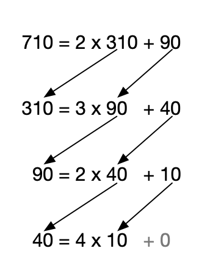

.. meta:: 
    :author: Michael Eichberg
    :keywords: Number Theory
    :description lang=en: Introduction to Number Theory
    :description lang=de: Einführung in die Zahlentheorie

.. |date| date::

.. role:: incremental

Introduction to Number Theory
=============================

:Book: *Cryptography and Network Security - Principles and Practice, 8th Edition, William Stallings*
:Lecturer: **Prof. Dr. Michael Eichberg**
:Version: |date|

.. image:: DHBW_CAS_LOGO.svg
    :alt: DHBW CAS Logo
    :scale: 4
    :class: logo

Divisibility
------------

.. class:: incremental

    - We say that a nonzero :math:`b` divides :math:`a` if :math:`a = mb` for some :math:`m`, where :math:`a`, :math:`b` and :math:`m` are integers.

    - :math:`b` divides :math:`a` if there is no remainder on division.

    - The notation :math:`b|a` is used to mean :math:`b` divides :math:`a`.

    - If :math:`b|a` we say that :math:`b` is a divisor of :math:`a`.

.. admonition:: Example
    :class: incremental

    The positive divisors of: :math:`24` 
    
    are: :math:`1`, :math:`2`, :math:`3`, :math:`4`, :math:`6`, :math:`8`, :math:`12` and :math:`24`; :math:`13 | 182`; :math:`-5 | 30`; :math:`17 | 289`; :math:`-3 | 33`; :math:`17 | 0`.

Properties of Divisibility
--------------------------

.. class:: incremental

    - If :math:`a|1`, then :math:`a = \pm 1`.

    - If :math:`a | b` and :math:`b|a`, then :math:`a = \pm b`.

    - Any :math:`b \neq 0` divides :math:`0`.

    - If :math:`a | b` and :math:`b|c`, then :math:`a|c`.

    .. admonition:: Example
        :class: incremental
    
        :math:`11|66, 66|198 \Rightarrow 11|198`

Properties of Divisibility
--------------------------

If :math:`b | g` and :math:`b|h`, then :math:`b|(mg+nh)` for arbitrary integers :math:`m` and :math:`n`.
    
.. admonition:: Example
    :class: incremental:

    :math:`3 | 27` and :math:`3|33 \Rightarrow 3|(m \times 27 + n \times 33)`

.. admonition:: Explanation 
    :class: incremental

    If :math:`b | g` then :math:`g` is of the form :math:`g = b \times g_1`  for some integer :math:`g_1`.

    If :math:`b | h` then :math:`h` is of the form :math:`h = b \times h_1`  for some integer :math:`h_1`.

    So: :math:`mg+nh = mb g_1 + n b h_1 = b \times (mg_1+nh_1)` and therefore :math:`b` divides :math:`mg+mh`

Division Algorithm
------------------

Given any positive integer :math:`n` and any nonnegative integer :math:`a`, if we divide :math:`a` by n we get an integer quotient :math:`q` and an integer remainder :math:`r` that obey the following relationship:

.. math:: 

    a = qn + r \qquad 0 \leq r < n; q = \left \lfloor{a/n} \right \rfloor

.. image:: 1-division_algorithm.png
    :alt: The relationship a=qn+r
    :class: incremental
    

Division Algorithm
------------------

.. image:: 1-division_algorithm_negative_a.png
    :alt: The relationship a=qn+r for negative a

.. admonition:: Example
    :class: incremental

    .. math:: 
        a = -11; n = 7; -11 = (-2)\times 7 + 3; \quad r = 3 \quad q = -2

Euclidean Algorithm
-------------------

One of the basic techniques of number theory.

Procedure for determing the greatest common divisor (GCD) of two positive integers.

.. admonition:: Definition

    Two integers are **relatively prime** if their only common positive integer factor is 1 (e.g. 7 and 9, but also 3 and 8).

Greatest Common Divisor (:ab:`GCD`)
-----------------------------------

.. class:: incremental

    - The greatest common divisor of two integers :math:`a` and :math:`b` is the largest integer that both divides :math:`a` and :math:`b`.

    - We use the notation :math:`gcd(a,b)` to mean the GCD of :math:`a` and b.

    - We define :math:`gcd(0,0) = 0`.

    - The **positive** integer :math:`c` is said to be the gcd of :math:`a` and :math:`b` if:

        - :math:`c` is a divisor of :math:`a` and :math:`b`
        - any divisor of :math:`a` and :math:`b` is a divisor of :math:`c`.

Greatest Common Divisor (:ab:`GCD`)
-----------------------------------

Alternative definition:

.. math:: 

    gcd(a,b) = max[k, such\,that\, k|a \, and \, k|b]

.. admonition:: Example

    .. class:: incremental

        :math:`gcd(60,24) =`

    .. class:: incremental

        :math:`gcd(60, -24) =`

    .. class:: incremental
        
        :math:`12`

Greatest Common Divisor (:ab:`GCD`)
-----------------------------------

We stated:

    two integers :math:`a` and :math:`b` are relatively prime iff  their only common positive integer factor is 1

    :math:`\Leftrightarrow`

    :math:`a` and :math:`b` are relatively prime if :math:`gcd(a,b)=1` 

Greatest Common Divisor (:ab:`GCD`)
-----------------------------------

Computing the GCD using the Euclidean algorithm.

..  To be done!!! 
    .. raw:: html
       <iframe src="Test/gcd animation/Standard/Standard.html" style="margin:auto;position:relative;width:600px;height:400px;overflow:hidden;" title="W3Schools Free Online Web Tutorials"></iframe>

.. image:: 1-Euclidean_algorithm.svg
    :width: 1600

Greatest Common Divisor (:ab:`GCD`)
-----------------------------------

Example of computing the GCD using the Euclidean algorithm.

Euclidean Algorithm
-------------------

.. csv-table:: 
    :header: "Step", "Dividend", "Divisor", "Quotient", "Remainder" 
    :width: 100%

    1, 1160718174, 316258250, 3, 211943424
    2, 316258250, 211943424, 1, 104314826
    3, 211943424, 104314826, 2, 3313772
    4, 104314826, 3313772, 31, 1587894
    5, 3313772, 1587894, 2, 137984
    6, 1587894, 137984, 11, 70070
    7, 137984, 70070, 1, 67914
    8, 70070, 67914, 1, 2156
    9, 67914, 2156, 31, 1078
    10, 2156, **1078**, 2, 0

Modular Arithmetic
------------------

The Modulus
___________

If a is an integer and n is a positive integer, we define :math:`a\; mod\; n` to be the remainder when a is divided by n. The integer n is called the modulus.

Thus, for any integer a:

.. math:: 
    
    a = qn + r \quad 0 \leq r < n; q = \left\lfloor a / n \right\rfloor

    a =  \left\lfloor a / n \right\rfloor \times n + (a\; mod\;  n)

.. admonition:: Example
    :class: incremental

    .. math::

        11\;  mod\;  7 = 4; \qquad -11\;  mod\;  7 = 3

Modular Arithmetic (Congruent modulo :math:`n`)
------------------------------------------------

- Two integers a and b are said to be congruent modulo n if :math:`(a\; mod\; n) = (b\; mod\; n)`

- This is written as :math:`a \equiv b(mod\; n)`.

- Note that if :math:`a \equiv 0 (mod\; n)`, then :math:`n|a`.

.. admonition:: Example
    :class: incremental

    .. math:: 

        73 \equiv 4 (mod\; 23); \qquad 21 \equiv -9 (mod\; 10)

.. admonition:: Note
    :class: incremental

    The operator :math:`mod` is used as a binary operator that produces a remainder and as a congruence relation that shows the equivalence of two integers.

Properties of Congruence
------------------------

Congruences have the following properties:

1. :math:`a \equiv b (mod\; n)` if :math:`n|(a-b)`
2. :math:`a \equiv b (mod\; n) \Rightarrow b \equiv a (mod\; n)`
3. :math:`a \equiv b (mod\; n)\; and\; b \equiv c (mod\; n) \Rightarrow a \equiv c (mod\; n)`

Properties of Congruence (Explained)
------------------------------------

    To demonstrate the first point, if :math:`n|(a - b)`, then :math:`(a - b) = kn` for some :math:`k`

    - So we can write :math:`a=b+kn`

    - Therefore, (a\; mod\; n) = (remainder when b + kn is divided by n) = (remainder when b is divided by n) = (b\; mod\; n)

    .. admonition:: Example
        :class: incremental

        :math:`23 = 8(mod\; 5)` because :math:`23 - 8 = 15 = 5* 3`

        :math:`-11 = 5(mod\; 8)` because :math:`-11 - 5 = -16 = 8* (-2)`

        :math:`81 = 0(mod\; 27)` because :math:`81 - 0 = 81 = 27* 3`

Modular Arithmetic
------------------

Modular arithmetic exhibits the following properties: 

1. :math:`[(a\; mod\; n) + (b\; mod\; n)]\; mod\; n = (a + b)\; mod\; n`
2. :math:`[(a\; mod\; n) - (b\; mod\; n)]\; mod\; n = (a - b)\; mod\; n`
3. :math:`[(a\; mod\; n) \times (b\; mod\; n)]\; mod\; n = (a \times b)\; mod\; n`

Modular Arithmetic (First Property)
-----------------------------------

Define :math:`(a\; mod\; n) = r_a` and :math:`(b\; mod\; n) = r_b`. Then we can write :math:`a = r_a + jn`` for some integer j and :math:`b = r_b + kn` for some integer k 
Then:

.. math:: 

    (a + b)\; mod\; n = (ra + jn + rb + kn)\; mod\; n
    = (ra + rb + (k + j)n)\; mod\; n
    = (ra + rb)\; mod\; n
    = [(a\; mod\; n) + (b\; mod\; n)]\; mod\; n

Modular Arithmetic (Examples of Properties)
-------------------------------------------

.. admonition:: Examples
    
    
    .. math::

        11\; mod\; 8 = 3;\qquad 15\; mod\; 8 = 7

    .. math::
        :class: incremental
        
        [(11\; mod\; 8) + (15\; mod\; 8)]\; mod\; 8 = 10\; mod\; 8 = 2 
        
        (11 + 15)\; mod\; 8 = 26\; mod\; 8 = 2

    .. math::
        :class: incremental

        [(11\; mod\; 8) - (15\; mod\; 8)]\; mod\; 8 = - 4\; mod\; 8 = 4 
        
        (11 - 15)\; mod\; 8 = -4\; mod\; 8 = 4

    .. math::
        :class: incremental

        [(11\; mod\; 8) \times (15\; mod\; 8)]\; mod\; 8= 21\; mod\; 8 = 5 
        
        (11 \times 15)\; mod\; 8 = 165\; mod\; 8 = 5

Modular Arithmetic Modulo 8
---------------------------

Definition

.. math:: 

    Z_n = {0,1,...,(n-1)}

Addition

.. csv-table:: 
    :header: ":math:`+`","0","1","2","3","4","5","6","7"

    0,*0*,1,2,3,4,5,6,7
    1,1,2,3,4,5,6,7,*0*
    2,2,3,4,5,6,7,*0*,1
    3,3,4,5,6,7,*0*,1,2
    4,4,5,6,7,*0*,1,2,3
    5,5,6,7,*0*,1,2,3,4
    6,6,7,*0*,1,2,3,4,5
    7,7,*0*,1,2,3,4,5,6

Modular Arithmetic Modulo 8
---------------------------

Multiplication

.. csv-table:: 
    :header: ×,"0","1","2","3","4","5","6","7"

    0, 0,0,0,0,0,0,0,0
    1, 0,*1*,2,3,4,5,6,7
    2, 0,2,4,6,0,2,4,6
    3, 0,3,6,*1*,4,7,2,5
    4, 0,4,0,4,0,4,0,4
    5, 0,5,2,7,4,*1*,6,3
    6, 0,6,4,2,0,6,4,2
    7, 0,7,6,5,4,3,2,*1*

.. 
    Generator script:
    for i in range(0,8):
    print(str(i)+", ",end="")
    for j in range(0,8):
        v = (i*j) % 8
        if v == 1:
            v = "*"+str(v)+"*"
        else:
            v = str(v)
        print(v+",",end="")
    print()

Modular Arithmetic Modulo 8
---------------------------

Additive and muliplicative inverse modulo 8.

.. note:: 

    The negative/additive inverse of an integer x is the integer y such that :math:`(x + y)\; mod\; 8 = 0`.  

    The muliplicative inverse of an integer x is the integer y such that :math:`(x \times y)\; mod\; 8 = 1`.

.. csv-table:: 
    :header: :math:`w`, :math:`-w`, :math:`w^{-1}`
    
    0, 0, :math:`-`
    1, 7, 1
    2, 6, :math:`-`
    3, 5, 3
    4, 4, :math:`-`
    5, 3, 5
    6, 2, :math:`-`
    7, 1, 7 

Properties of Modular Arithmetic for Integers in :math:`Z_n`
------------------------------------------------------------

:Commutative Laws:

    

    :math:`(w + x)\; mod\; n = (x + w)\; mod\; n`

    :math:`(w \times x)\; mod\; n = (x \times w)\; mod\; n`

.. class:: incremental

    :Associative Laws:

        :math:`[(w + x) + y]\; mod\; n = [w + (x + y)]\; mod\; n`

        :math:`[(w \times x) \times y]\; mod\; n = [w \times (x \times y)]\; mod\; n`

.. class:: incremental

    :Distributive Law:
        :math:`[w \times (x + y)]\; mod\; n = [(w \times x) + (w \times y)]\; mod\; n`

.. class:: incremental

    :Identities:
        :math:`(0 + w)\; mod\; n = w\; mod\; n`
        :math:`(1 \times w)\; mod\; n = w\; mod\; n`

.. class:: incremental

    :Additive Inverse (-w):
        For each :math:`w \in Z_n` there exists a zu such that :math:`w + z \equiv 0\; mod\; n`

Prime Numbers
-------------

.. class:: incremental

   - Prime numbers only have divisors of 1 and itself.
   - They cannot be written as a product of other numbers
   - Prime numbers are central to number theory
   - Any integer a > 1 can be factored in a unique way as: :math:`a=p_1^{a_1} \times p_2^{a_2} \times \dots \times p_t^{a_1}`  where :math:`p_1 < p_2 < . . . < p_t` are prime numbers and where each :math:`a_i` is a positive integer
   - This is known as the fundamental theorem of arithmetic.
  
.. admonition:: Note
    :class: incremental

    .. math:: 

        a = \displaystyle \prod_{p \in P} p^{a_p}\qquad where\; each\; a_p \geq 0

Fermat's theorem
----------------

.. admonition:: Note
    :class: note

    Important in public-key cryptography.

States the following:

- If p is prime and a is a positive integer not divisible by p then :math:`a^{p-1} \equiv 1 (mod\;p)`

.. class:: incremental

    Alternative form:
    
    - If p is prime and a is a positive integer then :math:`a^p \equiv a(mod\; p)`

Some values of Euler's Totient Function :math:`\phi(n)`
-------------------------------------------------------

Euler's totient function (:math:`\phi(n)`.) is defined as the number of positive integers less than n and relatively prime to n; by convention :math:`\phi(1) = 1`.

.. csv-table:: 
    :header: 𝜑(n), +0, +1, +2, +3, +4, +5, +6, +7, +8, +9

    0+, / , 1, 1, 2, 2, 4, 2, 6, 4, 6
    10+, 4, 10, 4, 12, 6, 8, 8, 16, 6, 18
    20+, 8, 12, 10, 22, 8, 20, 12, 18, 12, 28
    30+, 8, 30, 16, 20, 16, 24, 12, 36, 18, 24
    40+, 16, 40, 12, 42, 20, 24, 22, 46, 16, 42
    50+, 20, 32, 24, 52, 18, 40, 24, 36, 28, 58
    60+, 16, 60, 30, 36, 32, 48, 20, 66, 32, 44
    70+, 24, 70, 24, 72, 36, 40, 36, 60, 24, 78
    80+, 32, 54, 40, 82, 24, 64, 42, 56, 40, 88
    90+, 24, 72, 44, 60, 46, 72, 32, 96, 42, 60

cf. https://de.wikipedia.org/wiki/Eulersche_Phi-Funktion

Euler's Theorem
----------------

States that for every a and n that are relatively prime: 

.. math::
        a^{\phi(n)} \equiv 1(mod\; n)

An alternative form is:

.. math::
        a^{\phi(n)+1} \equiv a (mod\; n)

Miller-Rabin Algorithm
----------------------

- Many cryptographic algorithms require one or more very large prime numbers at random. 
- The Miller-Rabin primality test is a probabilistic primality test that is fast and simple. 

- Background: Any positive odd integer :math:`n \geq 3` can be expressed as :math:`n-1 = 2^kq \qquad with\; k > 0, q\; odd`

Miller-Rabin Algorithm
----------------------

.. code:: pseudocode

    TEST(n, k) # n > 2, an odd integer to be tested for primality
               # k, the number of rounds of testing to perform

    let s > 0 and d odd > 0 such that n−1 = pow(2,s)*d  
    repeat k times:
        a ← random(2, n−2)
        x ← pow(a,d) mod n
        repeat s times:
            y ← sqr(x) mod n
            if y = 1 and x ≠ 1 and x ≠ n−1 then return “composite”
            x ← y
        if y ≠ 1 then return “composite”
    return “probably prime”

Deterministic Primality Algorithm
---------------------------------

.. class:: incremental

  - Prior to 2002 there was no known method of efficiently proving the primality of very large numbers.
  - All of the algorithms in use produced a probabilistic result
  - In 2002 Agrawal, Kayal, and Saxena developed an algorithm that efficiently determines whether a given large number is prime:
    - Known as the AKS algorithm.
    - Does not appear to be as efficient as the Miller-Rabin algorithm.

Chinese Remainder Theorem (CRT)
-------------------------------

.. note:: 
     
    Provides a way to manipulate (potentially very large) numbers mod M in terms of tuples of smaller numbers
      
      - This can be useful when M is 150 digits or more
      - However, it is necessary to know beforehand the factorization of M

- Believed to have been discovered by the Chinese mathematician Sun-Tsu in around 100 A.D.
- One of the most useful results of number theory
- Says it is possible to reconstruct integers in a certain range from their residues modulo a set of pairwise relatively prime moduli
- Can be stated in several ways
  