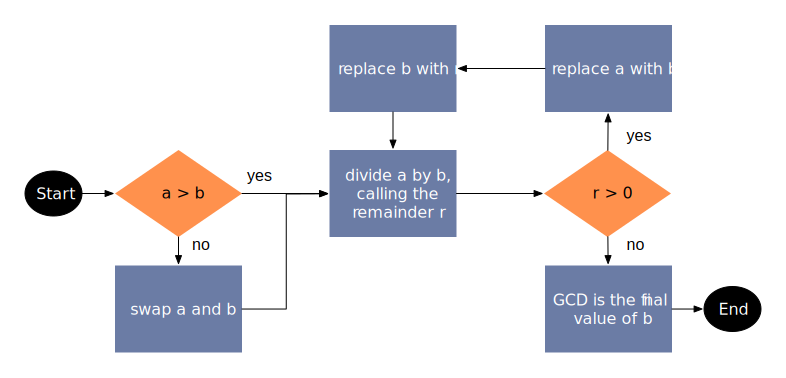

.. meta:: 
    :author: Michael Eichberg
    :keywords: Number Theory
    :description lang=en: Introduction to Number Theory
    :description lang=de: Einführung in die Zahlentheorie

.. |date| date::

.. role:: incremental

Introduction to Number Theory
=============================

:Book: *Cryptography and Network Security - Principles and Practice, 8th Edition, William Stallings*
:Lecturer: **Prof. Dr. Michael Eichberg**
:Version: |date|

.. image:: DHBW_CAS_LOGO.svg
    :alt: DHBW CAS Logo
    :scale: 4
    :class: logo

Divisibility
------------

.. class:: incremental

    - We say that a nonzero :math:`b` divides :math:`a` if :math:`a = mb` for some :math:`m`, where :math:`a`, :math:`b` and :math:`m` are integers.

    - :math:`b` divides :math:`a` if there is no remainder on division.

    - The notation :math:`b|a` is used to mean :math:`b` divides :math:`a`.

    - If :math:`b|a` we say that :math:`b` is a divisor of :math:`a`.

.. admonition:: Example
    :class: incremental

    The positive divisors of: :math:`24` 
    
    are: :math:`1`, :math:`2`, :math:`3`, :math:`4`, :math:`6`, :math:`8`, :math:`12` and :math:`24`; :math:`13 | 182`; :math:`-5 | 30`; :math:`17 | 289`; :math:`-3 | 33`; :math:`17 | 0`.

Properties of Divisibility
--------------------------

.. class:: incremental

    - If :math:`a|1`, then :math:`a = \pm 1`.

    - If :math:`a | b` and :math:`b|a`, then :math:`a = \pm b`.

    - Any :math:`b \neq 0` divides :math:`0`.

    - If :math:`a | b` and :math:`b|c`, then :math:`a|c`.

    .. admonition:: Example
        :class: incremental
    
        :math:`11|66, 66|198 \Rightarrow 11|198`

Properties of Divisibility
--------------------------

If :math:`b | g` and :math:`b|h`, then :math:`b|(mg+nh)` for arbitrary integers :math:`m` and :math:`n`.
    
.. admonition:: Example
    :class: incremental:

    :math:`3 | 27` and :math:`3|33 \Rightarrow 3|(m \times 27 + n \times 33)`

.. admonition:: Explanation 
    :class: incremental

    If :math:`b | g` then :math:`g` is of the form :math:`g = b \times g_1`  for some integer :math:`g_1`.

    If :math:`b | h` then :math:`h` is of the form :math:`h = b \times h_1`  for some integer :math:`h_1`.

    So: :math:`mg+nh = mb g_1 + n b h_1 = b \times (mg_1+nh_1)` and therefore :math:`b` divides :math:`mg+mh`

Division Algorithm
------------------

Given any positive integer :math:`n` and any nonnegative integer :math:`a`, if we divide :math:`a` by n we get an integer quotient :math:`q` and an integer remainder :math:`r` that obey the following relationship:

.. math:: 

    a = qn + r \qquad 0 \leq r < n; q = \left \lfloor{a/n} \right \rfloor

.. image:: 1-division_algorithm.png
    :alt: The relationship a=qn+r
    :class: incremental
    

Division Algorithm
------------------

.. image:: 1-division_algorithm_negative_a.png
    :alt: The relationship a=qn+r for negative a

.. admonition:: Example
    :class: incremental

    .. math:: 
        a = -11; n = 7; -11 = (-2)\times 7 + 3; \quad r = 3 \quad q = -2

Euclidean Algorithm
-------------------

One of the basic techniques of number theory.

Procedure for determing the greatest common divisor (GCD) of two positive integers.

Two integers are relatively prime if their only common positive integer factor is 1 (e.g. 7 and 9).

Greatest Common Divisor (:ab:`GCD`)
-----------------------------------

.. class:: incremental

    - The greatest common divisor of two integers :math:`a` and :math:`b` is the largest integer that both divides :math:`a` and :math:`b`.

    - We use the notation :math:`gcd(a,b)` to mean the GCD of :math:`a` and b.

    - We define :math:`gcd(0,0) = 0`.

    - The **positive** integer :math:`c` is said to be the gcd of :math:`a` and :math:`b` if:

        - :math:`c` is a divisor of :math:`a` and :math:`b`
        - any divisor of :math:`a` and :math:`b` is a divisor of :math:`c`.

Greatest Common Divisor (:ab:`GCD`)
-----------------------------------

Alternative definition:

.. math:: 

    gcd(a,b) = max[k, such\,that\, k|a \, and \, k|b]

.. admonition:: Example

    .. class:: incremental

        :math:`gcd(60,24) =`

    .. class:: incremental

        :math:`gcd(60, -24) =`

    .. class:: incremental
        
        :math:`12`

Greatest Common Divisor (:ab:`GCD`)
-----------------------------------

We stated:

    two integers :math:`a` and :math:`b` are relatively prime iff  their only common positive integer factor is 1

    :math:`\Leftrightarrow`

    :math:`a` and :math:`b` are relatively prime if :math:`gcd(a,b)=1` 

Greatest Common Divisor (:ab:`GCD`)
-----------------------------------

Computing the GCD using the Euclidean algorithm.

..  To be done!!! 
    .. raw:: html
       <iframe src="Test/gcd animation/Standard/Standard.html" style="margin:auto;position:relative;width:600px;height:400px;overflow:hidden;" title="W3Schools Free Online Web Tutorials"></iframe>

Greatest Common Divisor (:ab:`GCD`)
-----------------------------------

Example of computing the GCD using the Euclidean algorithm.

.. image:: 1-Euclidean_algorithm_example.png

Euclidean Algorithm
-------------------

.. csv-table:: 
    :header: "Step", "Dividend", "Divisor", "Quotient", "Remainder" 
    :width: 100%

    1, 1160718174, 316258250, 3, 211943424
    2, 316258250, 211943424, 1, 104314826
    3, 211943424, 104314826, 2, 3313772
    4, 104314826, 3313772, 31, 1587894
    5, 3313772, 1587894, 2, 137984
    6, 1587894, 137984, 11, 70070
    7, 137984, 70070, 1, 67914
    8, 70070, 67914, 1, 2156
    9, 67914, 2156, 31, 1078
    10, 2156, **1078**, 2, 0

Modular Arithmetic
------------------

The Modulus
___________

If a is an integer and n is a positive integer, we define :math:`a\; mod\; n` to be the remainder when a is divided by n. The integer n is called the modulus.

Thus, for any integer a:

.. math:: 
    
    a = qn + r \quad 0 \leq r < n; q = \left\lfloor a / n \right\rfloor

    a =  \left\lfloor a / n \right\rfloor \times n + (a\; mod\;  n)

.. admonition:: Example
    :class: incremental

    .. math::

        11\;  mod\;  7 = 4; \qquad -11\;  mod\;  7 = 3

Modular Arithmetic (Congruent modulo :math:`n`)
------------------------------------------------

- Two integers a and b are said to be congruent modulo n if :math:`(a\; mod\; n) = (b\; mod\; n)`

- This is written as :math:`a \equiv b(mod\; n)`.

- Note that if :math:`a \equiv 0 (mod\; n)`, then :math:`n|a`.

.. admonition:: Example
    :class: incremental

    .. math:: 

        73 \equiv 4 (mod\; 23); \qquad 21 \equiv -9 (mod\; 10)

.. admonition:: Note
    :class: incremental

    The operator :math:`mod` is used as a binary operator that produces a remainder and as a congruence relation that shows the equivalence of two integers.

Properties of Congruence
------------------------

Congruences have the following properties:

1. :math:`a \equiv b (mod\; n)` if :math:`n|(a-b)`
2. :math:`a \equiv b (mod\; n) \Rightarrow b \equiv a (mod\; n)`
3. :math:`a \equiv b (mod\; n)\; and\; b \equiv c (mod\; n) \Rightarrow a \equiv c (mod\; n)`

