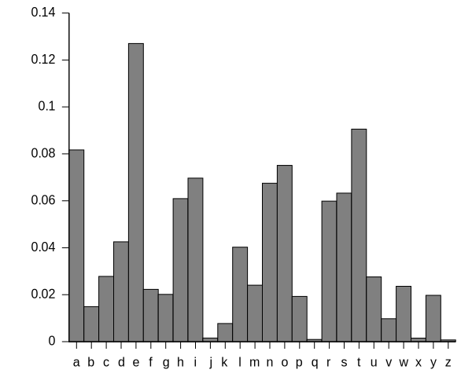

.. meta:: 
    :author: Michael Eichberg
    :keywords: Encryption
    :description lang=en: Classical Encryption Techniques
    :description lang=de: Klassische Verschlüsselungsmethoden
    :first-slide: last

.. :first-slide: last is only used while creating the slides!

.. |date| date::

.. role:: incremental

Classical Encryption Techniques
===============================

:Book: *Cryptography and Network Security - Principles and Practice, 8th Edition, William Stallings*
:Lecturer: **Prof. Dr. Michael Eichberg**
:Version: |date|

.. image:: DHBW_CAS_LOGO.svg
    :alt: DHBW CAS Logo
    :scale: 4
    :class: logo

Definitions
-----------

:Plaintext: An original message.
:Ciphertext: The coded (encrypted) message.
:Encryption(Enciphering): The process of converting from plaintext to ciphertext.
:Decryption(Deciphering): Restoring the plaintext from ciphertext.

Definitions
-----------

:Cryptography: The area of study of the schemes used for encryption.
:Cryptographic system/Cipher: A scheme.
:Cryptanalysis: Techniques used for deciphering a message without any knowledge of the enciphering details
:Cryptology: The areas of cryptography and cryptanalysis.

Simplified Model of Symmetric Encryption
----------------------------------------

TODO

Symmetric Cipher Model
----------------------
 

There are two requirements for secure use of conventional encryption:

1.  A strong encryption algorithm
2. Sender and receiver must have obtained copies of the secret key in a secure fashion and must keep the key secure

Model of Symmetric Cryptosystem
-------------------------------

TODO

Cryptographic Systems can be Characterized along three independent dimensions.
------------------------------------------------------------------------------------------

.. note::

    A permutation is a sequence of transpositions.

.. class:: incremental

   1. The type of operations used for transforming plaintext to ciphertext.

      - Substitution
      - Transposition
  
        

   2. The number of keys used.
    
      - Symmetric, single-key, secret-key, conventional encryption
      - Asymmetric, two-key or public-key encryption
  
   3. The way in which the plaintext is processed.
   

      - Block Cipher
      - Stream Cipher

Cryptanalysis and Brute-Force Attack
------------------------------------

.. class:: incremental

    **Cryptanalysis**

    - Attack relies on the nature of the algorithm plus some knowledge of the general characteristics of the plaintext
    - Attack exploits the characteristics of the algorithm to attempt to deduce a specific plaintext or to deduce the key being used

.. class:: incremental

    **Brute-force attack**

    - Attacker tries every possible key on a piece of ciphertext until an intelligible translation into plaintext is obtained
    - On average, half of all possible keys must be tried to achieve success

Classification of Attacks
--------------------------

:*Type of Attack*:  *<Known to Cryptanalyst>*

:Ciphertext Only:
    - encryption algorithm
    - ciphertext

:Known Plaintext:
    - encryption algorithm
    - ciphertext
    - one or more plaintext-ciphertext pairs formed with the secret key

:Chosen Plaintext:
    - encryption algorithm
    - ciphertext
    - plaintext message chosen by cryptanalyst, together with its ciphertext generated with the secret key

Classification of Attacks
--------------------------

:*Type of Attack*:  *<Known to Cryptanalyst>*

:Chosen Chiphertext:

    - encryption algorithm
    - ciphertext
    - ciphertext chosen by cryptanalyst, together with its corresponding decrypted plaintext generated with the secret key

:Chosen Text:
    - encryption algorithm
    - ciphertext
    - plaintext message chosen by cryptanalyst, together with its corresponding ciphertext generated with the secret key
    - ciphertext chosen by cryptanalyst, together with its corresponding decrypted plaintext generated with the secret key

Encryption Scheme Security
---------------------------

*Unconditionally secure*

- No matter how much time an opponent has, it is impossible for him or her to decrypt the ciphertext simply because the required information is not there

.. class:: incremental

    *Computationally secure*

    - The cost of breaking the cipher exceeds the value of the encrypted information
    - The time required to break the cipher exceeds the useful lifetime of the information

.. admonition:: Question
    :class: incremental

    How long could the usefulness of some information be?

Brute-Force Attack
------------------

.. class:: incremental

    - Involves trying every possible key until an intelligible translation of the ciphertext into plaintext is obtained.

    - On average, half of all possible keys must be tried to achieve success.
 
    - To supplement the brute-force approach, some degree of knowledge about the expected plaintext is needed, and some means of automatically distinguishing plaintext from garble is also needed.

Substitution Technique
----------------------

- Is one in which the letters of plaintext are replaced by other letters or by numbers or symbols.

- If the plaintext is viewed as a sequence of bits, then substitution involves replacing plaintext bit patterns with ciphertext bit patterns.

Caesar Cipher
-------------

- Simplest and earliest known use of a substitution cipher; used by Julius Caesar.
- Involves replacing each letter of the alphabet with the letter standing three places further down the alphabet.
- Alphabet is wrapped around so that the letter following Z is A.

    :: 

        plain:    meet me after the toga party

    .. class:: incremental
        
        ::

            cipher:   PHHW PH DIWHU WKH WRJD SDUWB 

Caesar Cipher Algorithm
-----------------------

Can define transformation as:

.. csv-table:: 
    :delim: space
    :class: small
    
        a b c d e f g h i j k l m n o p q r s t u v w x y z 
        D E F G H I J K L M N O P Q R S T U V W X Y Z A B C

Mathematically give each letter a number:

.. csv-table:: 
    :delim: space
    :class: small

        a b c d e f g h i j k l m n o p q r s t u v w x y z
        0 1 2 3 4 5 6 7 8 9 10 11 12 13 14 15 16 17 18 19 20 21 22 23 24 25

Algorithm can be expressed as: 

.. math::
    C = E(3, p) = (p + 3)\; mod\; 26

Caesar Cipher Algorithm
-----------------------

A shift may be of any amount, so that the general Caesar algorithm is: 

.. math::

    C = E(k, p)= (p + k)\; mod\; 26

Where k takes on a value in the range 1 to 25; the decryption algorithm is simply:

.. math::

    p = D(k,C) = (C - k)\; mod\; 26

Brute-Force Cryptanalysis of Caesar Cipher
------------------------------------------

.. csv-table:: 
    :delim: space
    :class: small
    :header: Key, PHHW, PH, DIWHU, WKH, WRJD, SDUWB 

    1 OGGV OG CHVGT VJG VQIC RCTVA
    2 NFFU NF BGUFS UIF UPHB QBSUZ
    3 MEET ME AFTER THE TOGA PARTY
    4 LDDS LD ZESDQ SGD SNFZ OZQSX
    5 KCCR KC YDRCP RFC RMEY NYPRW
    6 JBBQ JB XCQBO QEB QLDX MXOQV
    7 IAAP IA WBPAN PDA PKCW LWNPU
    8 HZZO HZ VAOZM OCZ OJBV KVMOT
    9 GYYN GY UZNYL NBY NIAU JULNS
    10 FXXM FX TYMXK MAX MHZT ITKMR
    11 EWWL EW SXLWJ LZW LGYS HSJLQ
    12 DVVK DV RWKVI KYV KFXR GRIKP
    13 CUUJ CU QVJUH JXU JEWQ FQHJO
    14 BTTI BT PUITG IWT IDVP EPGIN
    15 ASSH AS OTHSF HVS HCUO DOFHM
    16 ZRRG ZR NSGRE GUR GBTN CNEGL
    ... ... ... ... ... ... ...
    25 QIIX QI EJXIV XLI XSKE TEVXC

Caesar Cipher Algorithm
-----------------------

Decryption is more complicated when the plaintext is already garble. E.g., as in case of a compressed file as seen below.

.. csv-table:: 
    :delim: space
    :class: hexdump

    00000000: 504b 0304 1400 0800 0800 afb1 4257 0000 PK..........BW..
    00000010: 0000 0000 0000 4f04 0000 0a00 2000 322d ......O....._.2-
    00000020: 4465 6d6f 2e74 7874 5554 0d00 076a 241b Demo.txtUT...j$.
    00000030: 656a 241b 656a 241b 6575 780b 0001 04f8 ej$.ej$.eux.....
    00000040: 0100 0004 1400 0000 edcc db09 8030 0c05 .............0..
    00000050: d07f a7c8 049d a28b c4f6 6203 e983 18d0 ..........b.....
    00000060: 6e2f ee91 ffc3 c928 b697 cb1c 2437 f569 n/.....(....$7.i
    00000070: a032 fb52 29ec a8f4 340c f206 5aca 321c .2.R)...4...Z.2.
    00000080: afff 8cd5 c075 d3c5 762a d291 2389 2492 .....u..v*..#.$.
    00000090: 48d2 0750 4b07 081d a9b0 b94b 0000 004f H..PK......K...O
    000000a0: 0400 0050 4b01 0214 0314 0008 0008 00af ...PK...........
    000000b0: b142 571d a9b0 b94b 0000 004f 0400 000a .BW....K...O....
    000000c0: 0020 0000 0000 0000 0000 00a4 8100 0000 ._..............
    000000d0: 0032 2d44 656d 6f2e 7478 7455 540d 0007 .2-Demo.txtUT...
    000000e0: 6a24 1b65 6a24 1b65 6a24 1b65 7578 0b00 j$.ej$.ej$.eux..
    000000f0: 0104 f801 0000 0414 0000 0050 4b05 0600 ...........PK...
    00000100: 0000 0001 0001 0058 0000 00a3 0000 0000 .......X........

Monoalphabetic Cipher
---------------------

- Permutation of a finite set of elements S is an ordered sequence of all the elements of S, with each element appearing exactly once.

.. class:: incremental

  - If the “cipher” line can be any permutation of the 26 alphabetic characters, then there are 26! or greater than 4 x 1026 possible keys

    - This is 10 orders of magnitude greater than the key space for DES
    - Approach is referred to as a monoalphabetic substitution cipher because a single cipher alphabet is used per message

English Letter Frequency
-------------------------

Monoalphabetic Ciphers
-----------------------

Easy to break because they reflect the frequency data of the original alphabet.

Countermeasure is to provide multiple substitutes (homophones) for a single letter.

Playfair Cipher
---------------

.. note:: 

    *Digram*

    - Two-letter combination
    - Most common is "*th*""

    *Trigram*

    - Three-letter combination
    - Most frequent is "*the*"

- Best-known multiple-letter encryption cipher
- Treats digrams in the plaintext as single units and translates these units into ciphertext digrams
- Based on the use of a 5 x 5 matrix of letters constructed using a keyword Invented by British scientist Sir Charles Wheatstone in 1854
- Used as the standard field system by the British Army in World War I and the U.S. Army and other Allied forces during World War II

Playfair Key Matrix
-------------------

Fill in letters of keyword (minus duplicates) from left to right and from top to bottom, then fill in the remainder of the matrix with the remaining letters in alphabetic order
Using the keyword MONARCHY:

.. csv-table:: 
    :delim: space

    M O N A R
    C H Y B D
    E F G I/J K
    L P Q S T
    U V W X Z

Playfair Example
----------------

TODO

Hill Cipher
-----------

- Developed by the mathematician Lester Hill in 1929.
- Strength is that it completely hides single-letter frequencies.
  
  - The use of a larger matrix hides more frequency information.
  - A 3 x 3 Hill cipher hides not only single-letter but also two-letter frequency information.

- Strong against a ciphertext-only attack but easily broken with a known plaintext attack

Polyalphabetic Ciphers
----------------------

.. note:: 

     
    **All these techniques have the following features in common:**

    - A set of related monoalphabetic substitution rules is used
    - A key determines which particular rule is chosen for a given transformation

Polyalphabetic substitution ciphers improve on the simple monoalphabetic technique by using different monoalphabetic substitutions as one proceeds through the plaintext message.

Vigenère Cipher
---------------

- Best known and one of the simplest polyalphabetic substitution ciphers
- In this scheme the set of related monoalphabetic substitution rules consists of the 26 Caesar ciphers with shifts of 0 through 25
- Each cipher is denoted by a key letter which is the ciphertext letter that substitutes for the plaintext letter a

Vigenère Cipher
---------------

TODO add table

Example of Vigenère Cipher
--------------------------

- To encrypt a message, a key is needed that is as long as the message.
- Usually, the key is a repeating keyword.

.. admonition:: Example
    :class: incremental

    If the keyword is deceptive, the message “we are discovered save yourself” is encrypted as:

    :: 

        key:        deceptivedeceptivedeceptive 
        plaintext:  wearediscoveredsaveyourself
        ciphertext: ZICVTWQNGRZGVTWAVZHCQYGLMGJ

    