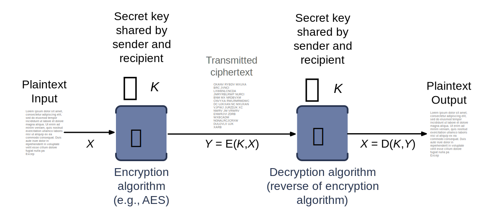
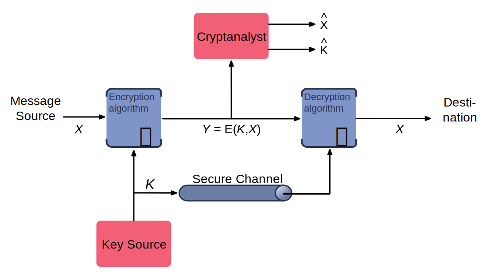
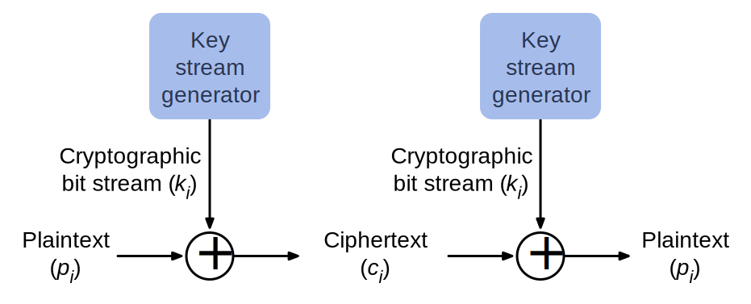

.. meta:: 
    :author: Michael Eichberg
    :keywords: Encryption
    :description lang=en: Classical Encryption Techniques
    :description lang=de: Klassische Verschlüsselungsmethoden
    :id: 2023_10-W3M20014-classical_encryption
    :first-slide: last-viewed

.. |date| date::

.. role:: incremental
.. role:: ger

Classical Encryption Techniques
===============================

:Lecturer: **Prof. Dr. Michael Eichberg**
:Version: |date|
:Based on: *Cryptography and Network Security - Principles and Practice, 8th Edition, William Stallings*

.. image:: logo.svg
    :alt: DHBW CAS Logo
    :scale: 4
    :class: logo

Definitions
-----------

:Plaintext: 
    :ger:`Klartext`

    An original message.

:Ciphertext: 
    :ger:`Geheimtext oder Chiffretext oder Krytogramm`

    The coded (encrypted) message.

:Encryption(Enciphering): The process of converting from plaintext to ciphertext.

:Decryption(Deciphering): Restoring the plaintext from ciphertext.

Definitions
-----------

:Cryptography: The area of study of the schemes used for encryption.
:Cryptographic system/Cipher: A scheme.
:Cryptanalysis: Techniques used for deciphering a message without any knowledge of the enciphering details
:Cryptology: The areas of cryptography and cryptanalysis.

Simplified Model of Symmetric Encryption
----------------------------------------

Symmetric Cipher Model
----------------------
 

There are two requirements for secure use of conventional encryption:

1.  A strong encryption algorithm
2. Sender and receiver must have obtained copies of the secret key in a secure fashion and must keep the key secure

Model of Symmetric Cryptosystem
-------------------------------

Cryptographic Systems can be Characterized along three independent dimensions.
------------------------------------------------------------------------------------------

.. note::

    A permutation is a sequence of transpositions.

.. class:: incremental

   1. The type of operations used for transforming plaintext to ciphertext.

      - Substitution
      - Transposition
  
        

   2. The number of keys used.
    
      - Symmetric, single-key, secret-key, conventional encryption
      - Asymmetric, two-key or public-key encryption
  
   3. The way in which the plaintext is processed.
   

      - Block Cipher
      - Stream Cipher

Cryptanalysis and Brute-Force Attack
------------------------------------

.. class:: incremental

    **Cryptanalysis**

    - Attack relies on the nature of the algorithm plus some knowledge of the general characteristics of the plaintext
    - Attack exploits the characteristics of the algorithm to attempt to deduce a specific plaintext or to deduce the key being used

.. class:: incremental

    **Brute-force attack**

    - Attacker tries every possible key on a piece of ciphertext until an intelligible translation into plaintext is obtained
    - On average, half of all possible keys must be tried to achieve success

Classification of Attacks
--------------------------

:*Type of Attack*:  *<Known to Cryptanalyst>*

:Ciphertext Only:
    - encryption algorithm
    - ciphertext

:Known Plaintext:
    - encryption algorithm
    - ciphertext
    - one or more plaintext-ciphertext pairs formed with the secret key

:Chosen Plaintext:
    - encryption algorithm
    - ciphertext
    - plaintext message chosen by cryptanalyst, together with its ciphertext generated with the secret key

Classification of Attacks
--------------------------

:*Type of Attack*:  *<Known to Cryptanalyst>*

:Chosen Chiphertext:

    - encryption algorithm
    - ciphertext
    - ciphertext chosen by cryptanalyst, together with its corresponding decrypted plaintext generated with the secret key

:Chosen Text:
    - encryption algorithm
    - ciphertext
    - plaintext message chosen by cryptanalyst, together with its corresponding ciphertext generated with the secret key
    - ciphertext chosen by cryptanalyst, together with its corresponding decrypted plaintext generated with the secret key

Encryption Scheme Security
---------------------------

*Unconditionally secure*

- No matter how much time an opponent has, it is impossible for him or her to decrypt the ciphertext simply because the required information is not there

.. class:: incremental

    *Computationally secure*

    - The cost of breaking the cipher exceeds the value of the encrypted information
    - The time required to break the cipher exceeds the useful lifetime of the information

.. admonition:: Question
    :class: incremental

    How long could the usefulness of some information be?

Brute-Force Attack
------------------

.. class:: incremental

    - Involves trying every possible key until an intelligible translation of the ciphertext into plaintext is obtained.

    - On average, half of all possible keys must be tried to achieve success.
 
    - To supplement the brute-force approach, some degree of knowledge about the expected plaintext is needed, and some means of automatically distinguishing plaintext from garble is also needed.

Substitution Technique
----------------------

- Is one in which the letters of plaintext are replaced by other letters or by numbers or symbols.

- If the plaintext is viewed as a sequence of bits, then substitution involves replacing plaintext bit patterns with ciphertext bit patterns.

Caesar Cipher
-------------

- Simplest and earliest known use of a substitution cipher; used by Julius Caesar.
- Involves replacing each letter of the alphabet with the letter standing three places further down the alphabet.
- Alphabet is wrapped around so that the letter following Z is A.

    :: 

        plain:    meet me after the toga party

    .. class:: incremental
        
        ::

            cipher:   PHHW PH DIWHU WKH WRJD SDUWB 

Caesar Cipher Algorithm
-----------------------

Can define transformation as:

.. csv-table:: 
    :delim: space
    :class: small
    
        a b c d e f g h i j k l m n o p q r s t u v w x y z 
        D E F G H I J K L M N O P Q R S T U V W X Y Z A B C

Mathematically give each letter a number:

.. csv-table:: 
    :delim: space
    :class: small

        a b c d e f g h i j k l m n o p q r s t u v w x y z
        0 1 2 3 4 5 6 7 8 9 10 11 12 13 14 15 16 17 18 19 20 21 22 23 24 25

Algorithm can be expressed as: 

.. math::
    C = E(3, p) = (p + 3)\; mod\; 26

Caesar Cipher Algorithm
-----------------------

A shift may be of any amount, so that the general Caesar algorithm is: 

.. math::

    C = E(k, p)= (p + k)\; mod\; 26

Where k takes on a value in the range 1 to 25; the decryption algorithm is simply:

.. math::

    p = D(k,C) = (C - k)\; mod\; 26

Brute-Force Cryptanalysis of Caesar Cipher
------------------------------------------

.. csv-table:: 
    :delim: space
    :class: small
    :header: Key, PHHW, PH, DIWHU, WKH, WRJD, SDUWB 

    1 OGGV OG CHVGT VJG VQIC RCTVA
    2 NFFU NF BGUFS UIF UPHB QBSUZ
    3 MEET ME AFTER THE TOGA PARTY
    4 LDDS LD ZESDQ SGD SNFZ OZQSX
    5 KCCR KC YDRCP RFC RMEY NYPRW
    6 JBBQ JB XCQBO QEB QLDX MXOQV
    7 IAAP IA WBPAN PDA PKCW LWNPU
    8 HZZO HZ VAOZM OCZ OJBV KVMOT
    9 GYYN GY UZNYL NBY NIAU JULNS
    10 FXXM FX TYMXK MAX MHZT ITKMR
    11 EWWL EW SXLWJ LZW LGYS HSJLQ
    12 DVVK DV RWKVI KYV KFXR GRIKP
    13 CUUJ CU QVJUH JXU JEWQ FQHJO
    14 BTTI BT PUITG IWT IDVP EPGIN
    15 ASSH AS OTHSF HVS HCUO DOFHM
    16 ZRRG ZR NSGRE GUR GBTN CNEGL
    ... ... ... ... ... ... ...
    25 QIIX QI EJXIV XLI XSKE TEVXC

Caesar Cipher Algorithm
-----------------------

Decryption is more complicated when the plaintext is already garble. E.g., as in case of a compressed file as seen below.

.. csv-table:: 
    :delim: space
    :class: hexdump

    00000000: 504b 0304 1400 0800 0800 afb1 4257 0000 PK..........BW..
    00000010: 0000 0000 0000 4f04 0000 0a00 2000 322d ......O....._.2-
    00000020: 4465 6d6f 2e74 7874 5554 0d00 076a 241b Demo.txtUT...j$.
    00000030: 656a 241b 656a 241b 6575 780b 0001 04f8 ej$.ej$.eux.....
    00000040: 0100 0004 1400 0000 edcc db09 8030 0c05 .............0..
    00000050: d07f a7c8 049d a28b c4f6 6203 e983 18d0 ..........b.....
    00000060: 6e2f ee91 ffc3 c928 b697 cb1c 2437 f569 n/.....(....$7.i
    00000070: a032 fb52 29ec a8f4 340c f206 5aca 321c .2.R)...4...Z.2.
    00000080: afff 8cd5 c075 d3c5 762a d291 2389 2492 .....u..v*..#.$.
    00000090: 48d2 0750 4b07 081d a9b0 b94b 0000 004f H..PK......K...O
    000000a0: 0400 0050 4b01 0214 0314 0008 0008 00af ...PK...........
    000000b0: b142 571d a9b0 b94b 0000 004f 0400 000a .BW....K...O....
    000000c0: 0020 0000 0000 0000 0000 00a4 8100 0000 ._..............
    000000d0: 0032 2d44 656d 6f2e 7478 7455 540d 0007 .2-Demo.txtUT...
    000000e0: 6a24 1b65 6a24 1b65 6a24 1b65 7578 0b00 j$.ej$.ej$.eux..
    000000f0: 0104 f801 0000 0414 0000 0050 4b05 0600 ...........PK...
    00000100: 0000 0001 0001 0058 0000 00a3 0000 0000 .......X........

Monoalphabetic Cipher
---------------------

- Permutation of a finite set of elements S is an ordered sequence of all the elements of S, with each element appearing exactly once.

.. class:: incremental

  - If the “cipher” line can be any permutation of the 26 alphabetic characters, then there are 26! or greater than 4 x 1026 possible keys

    - This is 10 orders of magnitude greater than the key space for DES
    - Approach is referred to as a monoalphabetic substitution cipher because a single cipher alphabet is used per message

English Letter Frequency
-------------------------

.. image:: 2-english_letter_frequency.svg
    :width: 1200px
    :alt: English letter frequency (alphabetic)

Monoalphabetic Ciphers
-----------------------

Easy to break because they reflect the frequency data of the original alphabet.

Countermeasure is to provide multiple substitutes (homophones) for a single letter.

Playfair Cipher
---------------

.. note:: 

    *Digram*

    - Two-letter combination
    - Most common is "*th*""

    *Trigram*

    - Three-letter combination
    - Most frequent is "*the*"

- Best-known multiple-letter encryption cipher
- Treats digrams in the plaintext as single units and translates these units into ciphertext digrams
- Based on the use of a 5 x 5 matrix of letters constructed using a keyword Invented by British scientist Sir Charles Wheatstone in 1854
- Used as the standard field system by the British Army in World War I and the U.S. Army and other Allied forces during World War II

Playfair Key Matrix
-------------------

Fill in letters of keyword (minus duplicates) from left to right and from top to bottom, then fill in the remainder of the matrix with the remaining letters in alphabetic order. The letters I and J count as one letter.

Using the keyword MONARCHY:

.. csv-table:: 
    :delim: space

    *M* *O* *N* *A* *R*
    *C* *H* *Y* B D
    E F G I/J K
    L P Q S T
    U V W X Z

Playfair Encryption
-------------------

Enryption is done on each pair of letters of the plaintext.

.. note::
    :class: smaller

    .. csv-table:: 
        :delim: space

        M O N A R
        C H Y B D
        E F G I/J K
        L P Q S T
        U V W X Z

.. class:: smaller

  1. If both letters are the same (or only one letter is left), add an "X" after the first letter. Encrypt the new pair and continue. (e.g., `ballon` would be encryped as `ba lx lo on`)
  2. If the letters appear on the same row, replace them with the letters to their immediate right respectively (wrap around if necessary). (e.g., `ar` is encrypted as `RM`)
  3. If the letters appear on the same column, replace them with the letters immediately below respectively (wrap around if necessary). (e.g., `mu` is encrypted as `CM`)
  4. If the letters are not on the same row or column, replace them with the letters on the same row respectively but at the other pair of corners of the rectangle defined by the original pair. (e.g., `hs` is encrypted as `BP` and `ea` as `IM`)

Hill Cipher
-----------

- Developed by the mathematician Lester Hill in 1929.
- Strength is that it completely hides single-letter frequencies.
  
  - The use of a larger matrix hides more frequency information.
  - A 3 x 3 Hill cipher hides not only single-letter but also two-letter frequency information.

- Strong against a ciphertext-only attack but easily broken with a known plaintext attack

Polyalphabetic Ciphers
----------------------

.. note:: 

     
    **All these techniques have the following features in common:**

    - A set of related monoalphabetic substitution rules is used
    - A key determines which particular rule is chosen for a given transformation

Polyalphabetic substitution ciphers improve on the simple monoalphabetic technique by using different monoalphabetic substitutions as one proceeds through the plaintext message.

Vigenère Cipher
---------------

- Best known and one of the simplest polyalphabetic substitution ciphers
- In this scheme the set of related monoalphabetic substitution rules consists of the 26 Caesar ciphers with shifts of 0 through 25
- Each cipher is denoted by a key letter which is the ciphertext letter that substitutes for the plaintext letter

Vigenère-Tableau
----------------

.. note::
    :class: smaller

    :header: plaintext letter
    :1. column: key letter
    :tableau: ciphertext letter

.. csv-table::
    :delim: space
    :align: center
    :class: small compact

    / **a** **b** **c** **d** **e** **f** **g** **h** **i** **j** **k** **l** **m** **n** **o** **p** **q** **r** **s** **t** **u** **v** **w** **x** **y** **z** 
    **A** A B C D E F G H I J K L M N O P Q R S T U V W X Y Z 
    **B** B C D E F G H I J K L M N O P Q R S T U V W X Y Z A 
    **C** C D E F G H I J K L M N O P Q R S T U V W X Y Z A B 
    **D** D E F G H I J K L M N O P Q R S T U V W X Y Z A B C 
    **E** E F G H I J K L M N O P Q R S T U V W X Y Z A B C D 
    **F** F G H I J K L M N O P Q R S T U V W X Y Z A B C D E 
    **G** G H I J K L M N O P Q R S T U V W X Y Z A B C D E F 
    **H** H I J K L M N O P Q R S T U V W X Y Z A B C D E F G 
    **I** I J K L M N O P Q R S T U V W X Y Z A B C D E F G H 
    **J** J K L M N O P Q R S T U V W X Y Z A B C D E F G H I 
    **K** K L M N O P Q R S T U V W X Y Z A B C D E F G H I J 
    **L** L M N O P Q R S T U V W X Y Z A B C D E F G H I J K 
    **M** M N O P Q R S T U V W X Y Z A B C D E F G H I J K L 
    **N** N O P Q R S T U V W X Y Z A B C D E F G H I J K L M 
    **O** O P Q R S T U V W X Y Z A B C D E F G H I J K L M N 
    **P** P Q R S T U V W X Y Z A B C D E F G H I J K L M N O 
    **Q** Q R S T U V W X Y Z A B C D E F G H I J K L M N O P 
    **R** R S T U V W X Y Z A B C D E F G H I J K L M N O P Q 
    **S** S T U V W X Y Z A B C D E F G H I J K L M N O P Q R 
    **T** T U V W X Y Z A B C D E F G H I J K L M N O P Q R S 
    **U** U V W X Y Z A B C D E F G H I J K L M N O P Q R S T 
    **V** V W X Y Z A B C D E F G H I J K L M N O P Q R S T U 
    **W** W X Y Z A B C D E F G H I J K L M N O P Q R S T U V 
    **X** X Y Z A B C D E F G H I J K L M N O P Q R S T U V W 
    **Y** Y Z A B C D E F G H I J K L M N O P Q R S T U V W X 
    **Z** Z A B C D E F G H I J K L M N O P Q R S T U V W X Y

Let's assume the key is `D`, the plaintext character is `b` then the ciphertext letter is `E`.

Example of Vigenère Cipher
--------------------------

- To encrypt a message, a key is needed that is as long as the message.
- Usually, the key is a repeating keyword.

.. admonition:: Example
    :class: incremental

    If the keyword is deceptive, the message “we are discovered save yourself” is encrypted as:

    :: 

        key:        deceptivedeceptivedeceptive 
        plaintext:  wearediscoveredsaveyourself
        ciphertext: ZICVTWQNGRZGVTWAVZHCQYGLMGJ

    
Vigenère Autokey System
--------------------------

- A keyword is concatenated with the plaintext itself to provide a running key.
  
.. admonition:: Example
    :class: incremental

    :: 

        key:        deceptivewearediscoveredsav 
        plaintext:  wearediscoveredsaveyourself
        ciphertext: ZICVTWQNGKZEIIGASXSTSLVVWLA

.. class:: incremental

    Even this scheme is vulnerable to cryptanalysis, because the key and the plaintext share the same frequency distribution of letters, a statistical technique can be applied.

Vernam Cipher
-------------

One-Time Pad
------------

.. class:: incremental

  - Improvement to Vernam cipher proposed by an Army Signal Corp officer, Joseph Mauborgne
  - Use a random key that is as long as the message so that the key need not be repeated
  - Key is used to encrypt and decrypt a single message and then is discarded
  - Each new message requires a new key of the same length as the new message
  - Scheme is unbreakable
    - Produces random output that bears no statistical relationship to the plaintext
    - Because the ciphertext contains no information whatsoever about the plaintext, there is simply no way to break the code

Difficulties when using a One-Time Pad
--------------------------------------

.. class:: incremental

  - The one-time pad offers complete security but, in practice, has two fundamental difficulties:

    .. class:: incremental

      1. There is the practical problem of making large quantities of random keys
         Any heavily used system might require millions of random characters on a regular basis
      2. Mammoth key distribution problem.
         For every message to be sent, a key of equal length is needed by both sender and receiver

  - Because of these difficulties, the one-time pad is of limited utility; useful primarily for low-bandwidth channels requiring very high security

  - The one-time pad is the only cryptosystem that exhibits perfect secrecy 

Rail Fence Cipher
-----------------

- Simplest transposition :ger:`Vertauschung` cipher.
- Plaintext is written down as a sequence of diagonals and then read off as a sequence of rows.

.. admonition:: Example
    :class: incremental

    To encipher the message “meet me after the toga party” with a rail fence of depth 2 (key), we would write:
    
    ::

        m e m a t r h t g p r y
         e t e f e t e o a a t

    Encrypted message is: MEMATRHTGPRYETEFETEOAAT

Row Transposition Cipher
------------------------

- Is a more complex transposition.
- Write the message in a rectangle, row by row, and read the message off, column by column, but permute the order of the columns.
- The order of the columns then becomes the key to the algorithm.

.. admonition:: Example
    :class: incremental

    ::

        Key:        4312567 
        Plaintext:  attackp
                    ostpone 
                    duntilt 
                    woamxyz
    
    Ciphertext: TTNAAPTMTSUOAODWCOIXKNLYPETZ

Steganography
-------------

.. class:: smaller enable-copy-to-clipboard

    Dear Friend ; We know you are interested in receiving cutting-edge announcement . If you are not interested in our publications and wish to be removed from our lists, simply do NOT respond and ignore this mail . This mail is being sent in compliance with Senate bill 1626 ; Title 4 , Section 305 . This is a ligitimate business proposal ! Why work for somebody else when you can become rich in 96 months . Have you ever noticed nobody is getting any younger & nobody is getting any younger . Well, now is your chance to capitalize on  this ! We will help you decrease perceived waiting time by 170% and use credit cards on your website ! You are guaranteed to succeed because we take all the risk ! But don't believe us . Mrs Anderson of Indiana tried us and says "I was skeptical but it worked for me" . We assure you that we operate within all applicable laws . You will blame yourself forever if you don't order now . Sign up a friend and you'll get a discount of 10% ! Thank-you for your serious consideration of our offer ! 

Use Spammimic https://www.spammimic.com/ to unhide the message.

..
    The encoded message is: "Success!"

Other Steganography Techniques
------------------------------

**Character marking**

Selected letters of printed or typewritten text are over-written in pencil. The marks are not visible unless the paper is held at an angle to bright light.

**Invisible ink**

A number of substances can be used for writing but leave no visible trace until heat or some chemical is applied to the paper.

**Pin punctures**

Small pin punctures on selected letters are ordinarily not visible unless the paper is held up in front of a light.

...

Steganography vs. Encryption
----------------------------

Steganography has a number of *drawbacks* when compared to encryption:

- It requires a lot of overhead to hide a relatively few bits of information
- Once the system is discovered, it becomes virtually worthless

The *advantage* of steganography:

- It can be employed by parties who have something to lose should the fact of their secret communication (not necessarily the content) be discovered.
- Encryption flags traffic as important or secret or may identify the sender or receiver as someone with something to hide.