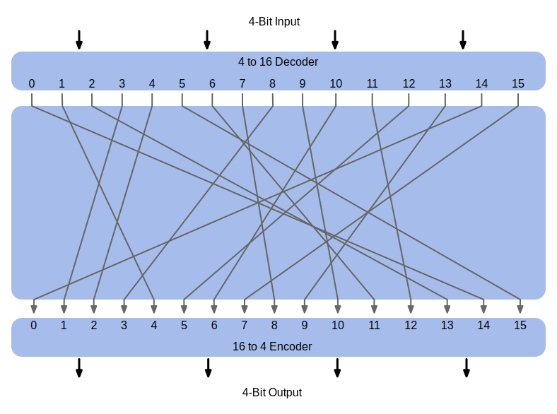

.. meta:: 
    :author: Michael Eichberg
    :keywords: Block Ciphers
    :description lang=en: Block Ciphers
    :description lang=de: Blockverschlüsselung
    :id: 2023_10-W3M20014-block_ciphers
    :first-slide: last-viewed

.. |date| date::

.. role:: incremental

Block Ciphers and the Data Encryption Standard 
===============================================

:Lecturer: **Prof. Dr. Michael Eichberg**
:Version: |date|
:Based on: *Cryptography and Network Security - Principles and Practice, 8th Edition, William Stallings*

.. image:: logo.svg
    :alt: DHBW CAS Logo
    :scale: 4
    :class: logo

Stream Cipher
--------------

- Encrypts a digital data stream one bit or one byte at a time. 
  
  Examples: Autokeyed Vigenère cipher and  Vernam cipher

- In the ideal case, a one-time pad version of the Vernam cipher would be used, in which the keystream is as long as the plaintext bit stream.

    .. class:: smaller

       - If the cryptographic keystream is random, then this cipher is unbreakable by any means other than acquiring the keystream

         .. class:: smaller

        • Keystream must be provided to both users in advance via some independent and secure channel
        • This introduces insurmountable logistical problems if the intended data traffic is very large
        

Stream Cipher
--------------

- For practical reasons the bit-stream generator must be implemented as an algorithmic procedure so that the cryptographic bit stream can be produced by both users.
  
  - It must be computationally impractical to predict future portions of the bit stream based on previous portions of the bit stream.
  - The two users need only share the generating key and each can produce the keystream.

Block Cipher
-------------

- A block of plaintext is treated as a whole and used to produce a ciphertext block of equal length.
- Typically a block size of 64 or 128 bits is used.
- As with a stream cipher, the two users share a symmetric encryption key.
- The majority of network-based symmetric cryptographic applications make use of block ciphers.

Stream Cipher vs. Block Cipher
------------------------------

.. image:: 3-stream_cipher.svg
    :align: left

.. image:: 3-block_cipher.svg
    :align: right
    :class: incremental
   

General n-bit-n-bit Block Substitution (n = 4)
-----------------------------------------------

Encryption and Decryption Tables for Substitution Cipher
---------------------------------------------------------

**Encryption Table**

.. list-table:: 
    :align: center
    :class: small
        
    * - Plaintext
      - 0000
      - 0001
      - 0010
      - 0011
      - 0100
      - 0101
      - 0110
      - 0111
      - 1000
      - 1001
      - 1010
      - 1011
      - 1100
      - 1101
      - 1110
      - 1111
    * - Ciphertext
      - 1110
      - 0100
      - 1101
      - 0001
      - 0010
      - 1111
      - 1011
      - 1000
      - 0011
      - 1010
      - 0110
      - 1100
      - 0101
      - 1001
      - 0000
      - 0111

**Decryption Table**

.. list-table:: 
    :align: center
    :class: small incremental

    * - Ciphertext
      - 0000
      - 0001
      - 0010
      - 0011
      - 0100
      - 0101
      - 0110
      - 0111
      - 1000
      - 1001
      - 1010
      - 1011
      - 1100
      - 1101
      - 1110
      - 1111
    * - Plaintext
      - 1110
      - 0011
      - 0100
      - 1000
      - 0001
      - 1100
      - 1010
      - 1111
      - 0111
      - 1101
      - 1001
      - 0110
      - 1011
      - 0010
      - 0000
      - 0101
 

Feistel Cipher
--------------

Feistel proposed the use of a cipher that alternates substitutions and permutations.

.. admonition:: Substitutions
    :class: incremental

    Each plaintext element or group of elements is uniquely replaced by a corresponding ciphertext element or group of elements

.. admonition:: Permutation
    :class: incremental

    No elements are added or deleted or replaced in the sequence, rather the order in which the elements appear in the sequence is changed

Feistel Cipher - Background
---------------------------

- This is a practical application of a proposal by Claude Shannon to develop a product cipher that alternates confusion and diffusion functions.

- It is the structure used by many significant symmetric block ciphers currently in use.

    .. container:: incremental

        *Diffusion and Confusion*

        - Terms introduced by Claude Shannon to capture the two basic building blocks for any cryptographic system.
        - Shannon’s concern was to thwart cryptanalysis based on statistical analysis.

**Diffusion** and Confusion
---------------------------

.. admonition:: Diffusion

    - The statistical structure of the plaintext is dissipated into long-range statistics of the ciphertext; i.e., makes the statistical relationship between the plaintext and ciphertext as complex as possible.
    - This is achieved by having each plaintext digit affect the value of many ciphertext digits.
    - Diffusion can be achieved, e.g., by *permutations*.

Diffusion and **Confusion**
---------------------------

.. admonition:: Confusion

    - Seeks to make the relationship between the statistics of the ciphertext and the value of the encryption key as complex as possible; i.e., a single change to the encrption key should affect many bits of the ciphertext.
    - Even if the attacker can get some handle on the statistics of the ciphertext, the way in which the key was used to produce that ciphertext is so complex as to make it difficult to deduce the key
    - Confusion can be realized, e.g., by *substitutions*.

Entropie
--------

TODO

Feistel Cipher - Encryption and Decryption
------------------------------------------

.. image:: 3-feistel.svg
    :width: 920px
    :align: center

Feistel Cipher - Example
------------------------

.. image:: 3-feistel-example.svg
    :width: 1680px
    :align: center

Feistel Cipher - Design Features 
--------------------------------

.. class:: two-columns small incremental

    :**Round function F**:
        Greater complexity generally means greater resistance to cryptanalysis
    
    :**Fast software encryption/decryption**: 
        In many cases, encrypting is embedded in applications or utility functions in such a way as to preclude a hardware implementation; accordingly, the speed of execution of the algorithm becomes a concern

    :**Ease of analysis**: 
        If the algorithm can be concisely and clearly explained, it is easier to analyze that algorithm for cryptanalytic vulnerabilities and therefore develop a higher level of assurance as to its strength

    :**Block size**:
        Larger block sizes mean greater security but reduced encryption/decryption speed for a given algorithm

    :**Key size**:
        Larger key size means greater security but may decrease encryption/decryption speeds

    :**Number of rounds**: 
        The essence of the Feistel cipher is that a single round offers inadequate security but that multiple rounds offer increasing security

    :**Subkey generation algorithm**: 
        Greater complexity in this algorithm should lead to greater difficulty of cryptanalysis

Data Encryption Standard (DES)
-------------------------------

- Issued in 1977 by the National Bureau of Standards (now NIST) as Federal Information Processing Standard 46
- Was the most widely used encryption scheme until the introduction of the Advanced Encryption Standard (AES) in 2001
- Algorithm itself is referred to as the Data Encryption Algorithm (DEA):

   - Data is encrypted in 64-bit blocks using a 56-bit key
   - The algorithm transforms 64-bit input in a series of steps into a 64-bit output
   - The same steps, with the same key, are used to reverse the encryption

DES General Design
-------------------

DES Round Function
-------------------

.. note::
    :class: small

    R is the right half of the message.

    E is an expansion function.

    S are substitution boxes.

    P is a permutation.

.. image:: 3-des-design-round_function.svg
    :width: 840px
    :align: left

DES Example
-----------

.. csv-table::
    :class: small hexdump
    :align: center
    
    Round, Ki, Li, Ri
    IP, , 5a005a00, 3cf03c0f
    1, 1e030f03080d2930, 3cf03c0f, bad22845
    2, 0a31293432242318, bad22845, 99e9b723
    3, 23072318201d0c1d, 99e9b723, Obae3b9e
    4, 05261d3824311a20, Obae3b9e, 42415649
    5, 3325340136002025, 42415649, 18b3fa41
    6, 123a2d0d04262a1c, 18b3fa41, 9616fe23
    7, 021f120b1c130611, 9616fe23, 67117cf2
    8, 1c10372a2832002b, 67117c12, c11bfc09
    9, 04292a380c341103, c11bfc09, 887fbe6c
    10, 2703212607280403, 887fbc6c, 60017e8b
    11, 2826390c31261504, 60017e8b, f596506e
    12, 12071c241a0a0108, f596506e, 738538b8
    13, 300935393c0d100b, 73853868, с6а62с4е
    14, 311e09231321182a, с6а62с4е, 56b0bd75
    15, 283d3e0227072528, 56b0bd75, 75e8fd8f
    16, 2921080b13143025, 75e8fd8f, 25896490
    IP-1, , da02ce3a, 89ecac3b

.. class:: small

DES subkeys are shown as eight 6-bit values in hex format (max value for :math:`k_i` is   :math:`2^6-1=63=0x3F`)

DES Example - Avalanche Effect in DES
----------------------------------------------------------

**Small change in plaintext**:

.. csv-table::
    :class: small hexdump
    :width: 800px
    :align: center

    Round, , δ, Round, , δ
     , "02468aceeca86420
    12468aceeca86420", 1, 9, "c11bfc09887fbc6c
    996911532eed7d94", 32
    1, "3cf03c0fbad22845
    3cf03c0fbad32845", 1, 10, "887fbc6c60017e8b
    2eed7d94d0f23094", 34
    2, "bad2284599e9b723
    bad3284539a9b7a3", 5, 11, "600f7e8bf596506e
    0f23094455da9c4", 37
    3, "99e9b7230bae3b9e
    39a9b7a3171cb8b3", 18, 12, "1596506e738538b8
    455da9c47f6e3cf3", 31
    4, "Obae3b9e42415649
    171cb8b3ccaca55e", 34, 13, "738538b8c6a62c4e
    7f6e3cf34bc1a8d9", 29
    5, "4241564918b3fa41
    ccaca55ed16c3653", 37, 14, "с6а62с4е56b0bd75
    4bc1a8d91e07d409", 33
    6, "18b3fa419616fe23
    d16c3653cf402c68", 33, 15, "56b0bd7575e8fd81
    1e07d4091ce2e6dc", 31
    7, "9616fe2367117cf2
    cf402c682b2cefbc", 32, 16, "75e8fd8625896490
    1ce2e6dc365e5f59", 32
    8, "67117cf2c11bfc09
    2b2cefbc99191153", 33, IP-1, "da02ce3a89ecac3b
    057cde97d7683f2a", 32

DES Example - Avalanche Effect in DES
----------------------------------------------------------

**Small change in key** (`0f1571c947d9e859` :math:`\rightarrow` `1f1571c947d9e859`):

.. csv-table::
    :class: small hexdump
    :width: 800px
    :align: center

    Round, , "δ", Round, , δ
     , "02468aceeca86420
    02468aceeca86420", 0, 9, "c11bfe09887fbe6c
    548f1de471f64dfd", 34
    1, "3c103c0fbad22845
    3ef03c019ad628e5", 3, 10, "8876be6c60067e8b
    71664dfd4279876c", 36
    2, "bad2284599e9b723
    9ad628c59939136b", 11, 11, "60017e8bf596506e
    4279876c399fdc0d", 32
    3, "99e9b7230bae3b9e
    9939136676806767", 25, 12, "f596506e738538b8
    399fde0d6d208dbb", 28
    4, "Obae3b9e42415649
    768067b75a8807c5", 29, 13, "738538b8c6a62c4e
    6d208dbbb9bdeeaa", 33
    5, "4241564918b3fa41
    5a8807c5488bde94", 26, 14, "c6a62c4e56b0bd75
    b9bdeeaad2c3a56f", 30
    6, "18b3fa419616fe23
    488dbe94aba7fe53", 26, 15, "56b0bd7575e8fd8f
    d2c3a5612765c1fb", 33
    7, "9616fe2367117cf2
    aba7fe53177d21e4", 27, 16, "75e8fd8f25896490
    2765c1fb01263dc4", 30
    8, "67117cf2c11bfc09
    177d21e4548f1de4", 32, IP-1, "da02ce3a89ecac3b
    ee92b50606b6260b", 30

Average Time for Exhaustive Key Search
--------------------------------------

.. csv-table::    
    :class: smaller
    :align: center

    Key size (bits), Cipher, "Number of Alternative
    Keys", "Time Required at :math:`10^9` 
    decryptions/s", "Time Required at :math:`10^{13}` 
    decryptions/s"
    56, DES, ":math:`2^{56}` ≈ 7.2 x :math:`10^{16}`", 1.125 years, 1 hour
    128, AES, ":math:`2^{128}` ≈ 3.4 x :math:`10^{38}`", "5.3 x :math:`10^{21}` years", "5.3 x :math:`10^{17}` years"
    168, Triple DES, ":math:`2^{168}` ≈ 3.7 x :math:`10^{50}`", "5.8 x :math:`10^{33}` years", 5.8 × :math:`10^{29}` years
    192, AES, ":math:`2^{192}` ≈ 6.3 x :math:`10^{57}`", ":math:`2^{191}` ns = 9.8 x :math:`10^{40}` years", "9.8 × :math:`10^{36}` years"
    256, AES, ":math:`2^{256}` ≈ 1.2 x :math:`10^{77}`", ":math:`2^{255}` ns = 1.8 x :math:`10^{60}` years", "1.8 x :math:`10^{56}` years"
    26 characters (permutation), Monoalphabetic, 26! = 4 x :math:`10^{26}`, "6.3 x :math:`10^9` years", 6.3 × :math:`10^6` years
  

Strength of DES - Timing Attacks
---------------------------------

.. class:: incremental

  - One in which information about the key or the plaintext is obtained by observing how long it takes a given implementation to perform decryptions on various ciphertexts.
  - Exploits the fact that an encryption or decryption algorithm often takes slightly different amounts of time on different inputs.
  - So far it appears unlikely that this technique will ever be successful against DES or more powerful symmetric ciphers such as triple DES and AES.

Block Cipher Design Principles - Number of Rounds
--------------------------------------------------

.. class:: incremental

  - The greater the number of rounds, the more difficult it is to perform cryptanalysis.
  - In general, the criterion should be that the number of rounds is chosen so that known cryptanalytic efforts require greater effort than a simple brute-force key search attack.
  - If DES had 15 or fewer rounds, differential cryptanalysis would require less effort than a brute-force key search.

Block Cipher Design Principles - Function F
-----------------------------------------------------

.. class:: incremental

  - The heart of a Feistel block cipher is the function F.
  - The more nonlinear F, the more difficult any type of cryptanalysis will be.
  - The algorithm should have good avalanche properties.

.. admonition:: Strict Avalanche Criterion (SAC)
    :class: incremental smaller

    States that any output bit j of an S-box should change with probability 1/2 when any single input bit i is inverted for all i, j
 
.. admonition:: Bit Independence Criterion (BIC)
    :class: incremental smaller

    States that output bits j and k should change independently when any single input bit i is inverted for all i, j, and k

.. class:: incremental
  
    - The SAC and BIC criteria appear to strengthen the effectiveness of the confusion function

Block Cipher Design Principles - Key Schedule Algorithm
-------------------------------------------------------

.. class:: incremental

  - With any Feistel block cipher, the key is used to generate one subkey for each round
  - In general, we would like to select subkeys to maximize the difficulty of deducing individual subkeys and the difficulty of working back to the main key.
  - It is suggested that, at a minimum, the key schedule should guarantee key/ciphertext **Strict Avalanche Criterion** and **Bit Independence Criterion**

