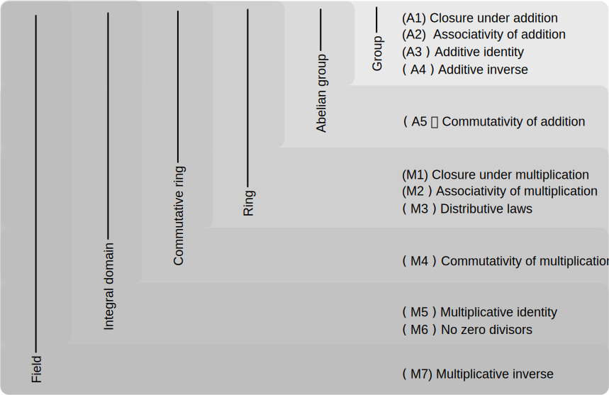
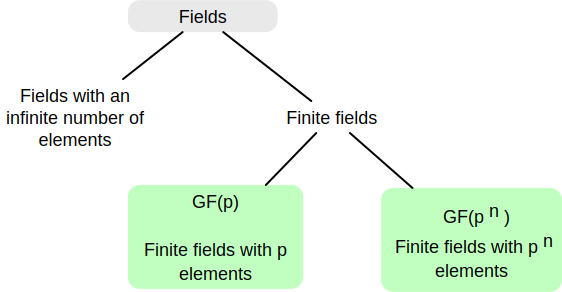
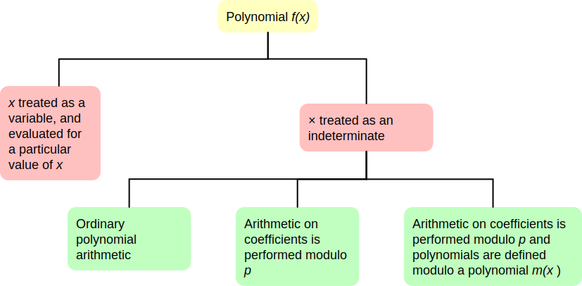

.. meta:: 
    :author: Michael Eichberg
    :keywords: Groups, Rings, Fields
    :description lang=en: (Finite) Fields
    :description lang=de: (Endliche) Körper
    :id: 2023_10-W3M20014-finite_fields
    :first-slide: last-viewed

.. |date| date::

.. role:: incremental
.. role:: ger
.. role:: red

Finite Fields
===============================================

:Lecturer: **Prof. Dr. Michael Eichberg**
:Version: |date|
:Based on: *Cryptography and Network Security - Principles and Practice, 8th Edition, William Stallings*

.. image:: logo.svg
    :alt: DHBW CAS Logo
    :scale: 4
    :class: logo

Groups, Rings and Fields
------------------------

::

    ((((((
        Finite Fields
            in Fields) 
                in Integral Domains) 
                    in Commutative Rings) 
                        in Rings) 
                            in Abelian Groups) 
                                in Groups)

.. admonition:: Note
    :class: small

    Integral Domains :ger:`Integritätsring`
    Field: :ger:`Körper``

Groups
-----------

A set of elements with a binary operation :math:`\cdot` that associates to each ordered pair :math:`(a,b)` of elements in :math:`G` an element :math:`(a \cdot b ) \in G` , such that the following axioms are obeyed:

.. class:: incremental

    :(A1) Closure:
        If :math:`a` and :math:`b` belong to :math:`G`, then :math:`a \cdot b` is also in :math:`G` 

    .. class:: incremental

        :(A2) Associative:
            :math:`a \cdot ( b \cdot c ) = ( a \cdot b ) \cdot c` for all :math:`a, b, c \in G`

    .. class:: incremental

        :(A3) Identity element:
            There is an element :math:`e \in G` such that :math:`a \cdot e = e \cdot a = a` for all :math:`a \in G`

    .. class:: incremental

        :(A4) Inverse element:
            For each :math:`a \in G`, there is an element :math:`a'` \in G such that :math:`a \cdot a' = a' \cdot a = e` 

Abelian Group
--------------

(A1 through A4) and:

:(A5) Commutative:
    :math:`a \cdot b = b \cdot a` for all :math:`a, b \in G`

Cyclic Group
--------------

• Exponentiation is defined within a group as a repeated application of the group operator, so that :math:`a^3 = a \cdot a \cdot a`.
• We define :math:`a^0 = e` as the identity element, and :math:`a^{-n} = (a')^n` , where :math:`a'` is the inverse element of :math:`a` within the group.
• A group :math:`G` is cyclic if every element of :math:`G` is a power :math:`a^k` (:math:`k` is an integer) of a fixed element :math:`a \in G`.
• The element :math:`a` is said to generate the group :math:`G` or to be a generator of :math:`G`.
• A cyclic group is always abelian and may be finite or infinite.

.. 
    A cyclic group is, e.g., {1,2,4,8,16,...} with a = 2; e = 1 (k does not have to part of the cyclic group.)

Rings
------

- A ring :math:`R`, sometimes denoted by :math:`\lbrace R , + , \times \rbrace`, is a set of elements with two binary operations, called addition and multiplication, such that for all :math:`a , b , c \in R` the axioms (A1-A5) are obeyed.

- :math:`R` is an abelian group with respect to addition; that is, :math:`R` satisfies axioms A1 through A5. For the case of an additive group, we denote the identity element as :math:`0` and the inverse of :math:`a` as :math:`–a`.

Rings
------

:(M1) Closure under multiplication:
    If :math:`a` and :math:`b` belong to :math:`R`, then :math:`ab` is also in :math:`R` 

:(M2) Associativity of multiplication:
    :math:`a(bc) = (ab)c` for all :math:`a,b,c \in R` 

:(M3) Distributive laws:
    :math:`a(b+c) = ab+ac` for all :math:`a,b,c \in R` 

    :math:`(a+b)c = ac+bc` for all :math:`a,b,c \in R` 

In essence, a ring is a set in which we can do addition, subtraction :math:`[a - b = a + (-b )]`, and multiplication without leaving the set.

Rings
------

- A ring is said to be commutative if it satisfies the following additional condition:
      
  :(M4) Commutativity of multiplication:
        :math:`ab = ba` for all :math:`a, b \in R`

Integral Domain :ger:`Integritätsring` 
---------------------------------------

A commutative ring that obeys the following axioms.

:(M5) Multiplicative identity:
    There is an element :math:`1` in :math:`R` such that :math:`a1 = 1a = a` for all :math:`a \in R` 

:(M6) No zero divisors:
    If :math:`a,b \in R` and :math:`ab = 0`, then either :math:`a = 0` or :math:`b = 0`

Fields :ger:`Körper`
--------------------

- A field :math:`F`, sometimes denoted by :math:`\lbrace F, +, \times \rbrace`, is a set of elements with two binary operations, called addition and multiplication, such that for all :math:`a, b, c \in F` the axioms (A1–M6) are obeyed. 
- :math:`F` is an integral domain; that is, :math:`F` satisfies axioms A1 through A5 and M1 through M6 
  
.. class:: incremental 
    
    :(M7) Multiplicative inverse:
        For each :math:`a` in :math:`F`, except :math:`0`, there is an element :math:`a^{-1} \in F` such that :math:`aa^{-1} = (a^{-1})a = 1`

Fields
------

- In essence, a field is a set in which we can do addition, subtraction, multiplication, and division without leaving the set. Division is defined with the following rule: :math:`a/b = a (b^{-1})`

.. admonition:: Note
    :class: incremental

    Familiar examples of fields are the rational numbers, the real numbers, and the complex numbers. 
    
    Note that the set of all integers is not a field, because not every element of the set has a multiplicative inverse.

Summary - Properties of Groups, Rings and Fields
-------------------------------------------------

Types of Fields
---------------

Finite Fields of the Form :math:`GF(p)`
----------------------------------------

- Finite fields play a crucial role in many cryptographic algorithms.
- It can be shown that the order of a finite field must be a power of a prime :math:`p^n`, where :math:`n` is a positive integer.
- The finite field of order :math:`p^n` is generally written :math:`GF(p^n)`. 
- GF stands for Galois field, in honor of the mathematician who first studied finite fields.

.. admonition:: Note
    :class: small

    The order of a finite field is the number of elements in the field.

Addition Modulo 8
------------------

.. csv-table::
    :align: center

    ":math:`+`", *0*, *1*, *2*, *3*, *4*, *5*, *6*, *7*
    *0*, :red:`0`, 1, 2, 3, 4, 5, 6, 7
    *1*, 1, 2, 3, 4, 5, 6, 7, :red:`0`
    *2*, 2, 3, 4, 5, 6, 7, :red:`0`, 1
    *3*, 3, 4, 5, 6, 7, :red:`0`, 1, 2
    *4*, 4, 5, 6, 7, :red:`0`, 1, 2, 3
    *5*, 5, 6, 7, :red:`0`, 1, 2, 3, 4
    *6*, 6, 7, :red:`0`, 1, 2, 3, 4, 5
    *7*, 7, :red:`0`, 1, 2, 3, 4, 5, 6

Multiplication Modulo 8
-----------------------

.. csv-table::
    :align: center

    ":math:`\times`", *0*, *1*, *2*, *3*, *4*, *5*, *6*, *7*
    *0*, 0, 0, 0, 0, 0, 0, 0, 0
    *1*, 0, :red:`1`, 2, 3, 4, 5, 6, 7
    *2*, 0, 2, 4, 6, 0, 2, 4, 6
    *3*, 0, 3, 6, :red:`1`, 4, 7, 2, 5
    *4*, 0, 4, 0, 4, 0, 4, 0, 4
    *5*, 0, 5, 2, 7, 4, :red:`1`, 6, 3
    *6*, 0, 6, 4, 2, 0, 6, 4, 2
    *7*, 0, 7, 6, 5, 4, 3, 2, :red:`1`

Additive and muliplicative inverses modulo 8
--------------------------------------------

.. csv-table::
    :align: center

    :math:`w`, :math:`-w`, :math:`w^{-1}`
    0,0,:math:`-`
    1,7,1
    2,6,:math:`-`
    3,5,3
    4,4,:math:`-`
    5,3,5
    6,2,:math:`-`
    7,1,7

Addition modulo 7
-----------------

.. csv-table::
    :align: center    

    ":math:`+`", *0*, *1*, *2*, *3*, *4*, *5*, *6*
    *0*, :red:`0`, 1, 2, 3, 4, 5, 6
    *1*, 1, 2, 3, 4, 5, 6, :red:`0`
    *2*, 2, 3, 4, 5, 6, :red:`0`, 1
    *3*, 3, 4, 5, 6, :red:`0`, 1, 2
    *4*, 4, 5, 6, :red:`0`, 1, 2, 3
    *5*, 5, 6, :red:`0`, 1, 2, 3, 4
    *6*, 6, :red:`0`, 1, 2, 3, 4, 5

Multiplication modulo 7
-----------------------

.. csv-table::
    :align: center 

    ":math:`\times`", *0*, *1*, *2*, *3*, *4*, *5*, *6*
    *0*, 0, 0, 0, 0, 0, 0, 0
    *1*, 0, :red:`1`, 2, 3, 4, 5, 6
    *2*, 0, 2, 4, 6, :red:`1`, 3, 5
    *3*, 0, 3, 6, 2, 5, :red:`1`, 4
    *4*, 0, 4, :red:`1`, 5, 2, 6, 3
    *5*, 0, 5, 3, :red:`1`, 6, 4, 2
    *6*, 0, 6, 5, 4, 3, 2, :red:`1`

Additive and muliplicative inverses modulo 7
--------------------------------------------

.. csv-table::
    :align: center

    :math:`w`, :math:`-w`, :math:`w^{-1}`
    0,0,:math:`-`
    1,6,1
    2,5,4
    3,4,5
    4,3,2
    5,2,3
    6,1,6

The Field GF(2)
---------------

.. container:: three-columns

    .. csv-table:: Addition
        :class: monospaced

        ":math:`+`", 0, 1
        0, 0, 1
        1, 1, 0

    .. csv-table:: Multiplication
        :class: monospaced

        ":math:`\times`",0,1
        0, 0, 0
        1, 0, 1
        
    .. csv-table:: Inverses
        :class: monospaced

        ":math:`w`", ":math:`-w`", ":math:`w^{-1}`"
        0, 0, 0
        1, 0, 1

Finite Fields
-------------

In this section, we have shown how to construct finite fields of order :math:`p` where :math:`p` is prim.

:math:`GF(p)` is defined with the following properties: 

1. :math:`GF(p)` consists of :math:`p` elements
2. The binary operations :math:`+` and :math:`\times` are defined over the set. The operations of addition, subtraction, multiplication, and division can be performed without leaving the set. Each element of the set other than 0 has a multiplicative inverse.

.. admonition:: Quintessence 
    :class: incremental
    
    We have shown that the elements of :math:`GF(p)` are the integers :math:`\lbrace 0, 1, . . . , p – 1 \rbrace` and that the arithmetic operations are addition and multiplication mod p.

.. admonition:: Note
    :class: small incremental

    Modular arithmetic modulo 8 is not a field.

Treatment of Polynomials
------------------------

.. class:: small 
    
    (indeterminate :ger:`unbestimmte`)

Example of Ordinary Polynomial Arithmetic
------------------------------------------

.. class:: incremental

  :Addition:
    .. math::

        (x^3 + x^2 + 2) + (x^2 - x + 1) = x^3 + 2x^2 - x + 3

  :Subtraction:
    .. math::

        (x^3 + x^2 + 2) - (x^2 - x + 1) = x^3 + x + 1

  :Multiplication:
    .. math::

        (x^3 + x^2 + 2) \times (x^2 - x + 1) = 

    .. class:: small

        .. math::
        
            \begin{matrix}   & & & & x^3 & + & x^2 & &  & + & 2 \\
                             & - & x^4 & - & x^3 & & & - & 2x & & & \\
                             x^5 & + & x^4 & & & + & 2x^2 & & & & &  =
            \end{matrix}

    .. math::

       x^{5} + 3x^2 - 2x + 2 

  :Division:
    .. math::

        (x^3 + x^2 + 2) : (x^2 - x + 1) = x + 2 + \left ( \frac{x}{x^2 - x + 1} \right )

Polynomial Arithmetic with Coefficients in :math:`Z_p`
-------------------------------------------------------

.. class:: incremental 
    

    • If each distinct polynomial is considered to be an element of the set, then that set is a ring.
    • When polynomial arithmetic is performed on polynomials over a field, then division is possible.
        
      .. admonition:: Note 

        This does not mean that exact division is possible.

    • If we attempt to perform polynomial division over a coefficient set that is not a field, we find that division is not always defined.

      • Even if the coefficient set is a field, polynomial division is not necessarily exact
      • With the understanding that remainders are allowed, we can say that polynomial division is possible if the coefficient set is a field

Polynomial Division
--------------------

.. class:: incremental 
    
        

    • We can write any polynomial in the form: :math:`f(x) = q(x) g(x) + r(x)` 

      • :math:`r(x)` can be interpreted as being a remainder
      • So :math:`r(x) = f(x)\; mod\; g(x)`
    
    • If there is no remainder we can say :math:`g(x)` divides :math:`f(x)` 

      • Written as :math:`g(x) | f(x)`
      • We can say that :math:`g(x)` is a factor of :math:`f(x)`
      • Or :math:`g(x)` is a divisor of :math:`f(x)`

    • A polynomial :math:`f(x)` over a field :math:`F` is called irreducible if and only if :math:`f(x)` cannot be expressed as a product of two polynomials, both over :math:`F`, and both of degree lower than that of :math:`f(x)`.

      • An irreducible polynomial is also called a prime polynomial.
    
    • Polynomial divsion can be defined in terms of multiplication if :math:`a,b \in F` then :math:`a/b = a \times b^{-1}` where :math:`b^{-1}` is the unique field element such that :math:`bb^{-1} = 1`. 
    
      .. TODO: check if the above statement is only true if the field is defined over a prime!

Example of Polynomial Arithmetic Over GF(2)
-------------------------------------------

.. admonition:: Recall
    :class: small

    .. math::

        \begin{matrix}
        1 + 1 & = 1 - 1 & = 0 \\
        1 + 0 & = 1 - 0 & = 1 \\
        0 + 1 & = 0 - 1 & = 1
        \end{matrix}

.. class:: incremental 
        
  :Addition:
    .. math::

        (x^7 + x^5 + x^4 + x^3 + x + 1) + (x^3 + x + 1) = x^7 + x^5 + x^4

.. class:: incremental 

  :Subtraction:
    .. math::

        (x^7 + x^5 + x^4 + x^3 + x + 1) - (x^3 + x + 1) = x^7 + x^5 + x^4

Example of Polynomial Arithmetic Over GF(2)
-------------------------------------------

.. admonition:: Recall
    :class: small
    
    .. math::

        \begin{matrix}
        1 + 1 & = 1 - 1 & = 0 \\
        1 + 0 & = 1 - 0 & = 1 \\
        0 + 1 & = 0 - 1 & = 1
        \end{matrix}

:Multiplication:
  .. math::

    (x^7 + x^5 + x^4 + x^3 + x + 1) \times (x^3 + x + 1) = 

  .. class:: small

    .. math::
    
        \begin{matrix} & & & & & & x^7 & + & & & x^5 & +&  x^4 & + & x^3 & + & & & x & + & 1 \\
                        & & & & x^8 & + & & & x^6 & + & x^5 & + & x^4 &+ & & & x^2 & + & x &  & & \\
                        x^{10} & + & & & x^8 & + & x^7 & + & x^6 & + & & & x^4 & + & x^3 & & & & & & &  =
        \end{matrix}

  .. math::

    x^{10} + x^4 +x^2 +1 

.. class:: incremental

  :Division:
    .. math::
        (x^7 + x^5 + x^4 + x^3 + x + 1) : (x^3 + x + 1) = x^4 + 1

Polynomial GCD
---------------

.. class:: incremental 
    
    - The polynomial :math:`c(x)` is said to be the greatest common divisor of :math:`a(x)` and :math:`b(x)` if the following are true:

      • :math:`c(x)` divides both :math:`a(x)` and :math:`b(x)`
      • Any divisor of :math:`a(x)` and :math:`b(x)` is a divisor of :math:`c(x)`
     
    - An equivalent definition is:

      • :math:`gcd[a(x), b(x)]` is the polynomial of maximum degree that divides both :math:`a(x)` and :math:`b(x)`

    - The Euclidean algorithm can be extended to find the greatest common divisor of two polynomials whose coefficients are elements of a field.

Arithmetic in :math:`GF(2^3)`: Addition (by means of XOR)
----------------------------------------------------------

.. csv-table:: 
    :align: center 

    " ", " ", *000*, *001*, *010*, *011*, *100*, *101*, *110*, *111*
    " ", ":math:`+`", *0*, *1*, *2*, *3*, *4*, *5*, *6*, *7*
    *000*,  *0*, :red:`0`, 1, 2, 3, 4, 5, 6, 7
    *001*,  *1*, 1, :red:`0`, 3, 2, 5, 4, 7, 6
    *010*,  *2*, 2, 3, :red:`0`, 1, 6, 7, 4, 5
    *011*,  *3*, 3, 2, 1, :red:`0`, 7, 6, 5, 4
    *100*,  *4*, 4, 5, 6, 7, :red:`0`, 1, 2, 3
    *101*,  *5*, 5, 4, 7, 6, 1, :red:`0`, 3, 2
    *110*,  *6*, 6, 7, 4, 5, 2, 3, :red:`0`, 1
    *111*,  *7*, 7, 6, 5, 4, 3, 2, 1, :red:`0`

.. admonition:: Recall
    :class: small 
        

    Subtraction of two field elements can be defined in terms of addition, if :math:`a, b \in F` then :math:`a − b = a + (-b)` , where :math:`−b` is the unique field element in :math:`F` such that :math:`b + (−b) = 0` (:math:`−b` is called the negative of :math:`b`).

Arithmetic in :math:`GF(2^3)`: Multiplication
---------------------------------------------

.. csv-table:: 
    :align: center 

    " ", " ", *000*, *001*, *010*, *011*, *100*, *101*, *110*, *111*
    " ", ":math:`\times`", *0*, *1*, *2*, *3*, *4*, *5*, *6*, *7*
    *000*,  *0*, 0, 0, 0, 0, 0, 0, 0, 0
    *001*,  *1*, 0, :red:`1`, 2, 3, 4, 5, 6, 7
    *010*,  *2*, 0, 2, 4, 6, 3, :red:`1`, 7, 5
    *011*,  *3*, 0, 3, 6, 5, 7, 4, :red:`1`, 2
    *100*,  *4*, 0, 4, 3, 7, 6, 2, 5, :red:`1`
    *101*,  *5*, 0, 5, :red:`1`, 4, 2, 7, 3, 6
    *110*,  *6*, 0, 6, 7, :red:`1`, 5, 3, 2, 4
    *111*,  *7*, 0, 7, 5, 2, :red:`1`, 6, 4, 3

.. admonition:: Note
    :class: small

    The number of occurences of the nonzero integers is uniform for multiplication. (In particular when compared to :math:`Z_8`)

Arithmetic in :math:`GF(2^3)`
--------------------------------------------------------------------------------------------------

Additive (:math:`-w`) and Multiplicative Inverses (:math:`w^{-1}`)
___________________________________________________________________

.. csv-table::
    :class: incremental
    :align: center
    :header: :math:`w`, :math:`-w`, :math:`w^{-1}`

    0,0,:math:`-`
    1,1,1
    2,2,5
    3,3,6
    4,4,7
    5,5,2
    6,6,3
    7,7,4

Polynomial Arithmetic in :math:`GF(2^3)` 
-----------------------------------------

To construct the finite field :math:`GF(2^3)`, we need to chose an irreducible polynomial of degree 3. I.e., either :math:`(x^3+x^2+1)` or  :math:`(x^3+x+1)`.

.. container:: smaller

    With multiplications modulo x^3 + x + 1, we have only the following eight polynomials in the set of polynomials over :math:`GF(2)`:

    .. math::

        0, 1, x, x^2, x+1, x^2 + 1, x^2 + x, x^2 + x + 1

.. admonition:: Note
    :class: incremental small

    AES performs the arithmetic in the finite field :math:`GF(2^8)` with the irreducible polynomial:

    .. math::

        m(x) = x^8 + x^4 + x^3 + x +1 

Polynomial Arithmetic in :math:`GF(2^3)` Modulo :math:`(x^3 + x + 1)` 
---------------------------------------------------------------------

Addition
________

.. csv-table:: 
    :class: small
    :align: center 

    " ", " ", *000*, *001*, *010*, *011*, *100*, *101*, *110*, *111*
    " ", ":math:`+`", *0*, *1*, :math:`x`, :math:`x+1`, :math:`x^2`, :math:`x^2+1`, :math:`x^2+x`, :math:`x^2+x+1`
    *000*,  *0*, :red:`0`, 1, x, :math:`x+1`, :math:`x^2`, :math:`x^2 + 1`, :math:`x^2 + x`, :math:`x^2 + x + 1` 
    *001*,  *1*, 1, :red:`0`, :math:`x+1`, x, :math:`x^2 + 1`, :math:`x^2`, :math:`x^2 + x + 1`, :math:`x^2 + x` 
    *010*,  :math:`x`, x, :math:`x+1`, :red:`0`, 1, :math:`x^2 + x`, :math:`x^2 + x + 1`, :math:`x^2`, :math:`x^2 + 1` 
    *011*,  :math:`x+1`, :math:`x+1`, x, 1, :red:`0`, :math:`x^2 + x + 1`, :math:`x^2 + x`, :math:`x^2 + 1`, :math:`x^2` 
    *100*,  :math:`x^2`, :math:`x^2`, :math:`x^2 + 1`, :math:`x^2 + x`, :math:`x^2 + x + 1`, :red:`0`, 1, x, :math:`x+1` 
    *101*,  :math:`x^2+1`, :math:`x^2 + 1`, :math:`x^2`, :math:`x^2 + x + 1`, :math:`x^2 + x`, 1, :red:`0`, :math:`x+1`, x
    *110*,  :math:`x^2+x`, :math:`x^2 + x`, :math:`x^2 + x + 1`, :math:`x^2`, :math:`x^2 + 1`, x, :math:`x+1`, :red:`0`, 1
    *111*,  :math:`x^2+x+1`, :math:`x^2 + x + 1`, :math:`x^2 + x`, :math:`x^2 + 1`, :math:`x^2`, :math:`x+1`, x, 1, :red:`0` 

Polynomial Arithmetic in :math:`GF(2^3)` Modulo :math:`(x^3 + x + 1)` 
---------------------------------------------------------------------

Multiplication
______________

.. csv-table:: 
    :class: small
    :align: center 

    " ", " ", *000*, *001*, *010*, *011*, *100*, *101*, *110*, *111*
    " ", ":math:`\times`", *0*, *1*, :math:`x`, :math:`x+1`, :math:`x^2`, :math:`x^2+1`, :math:`x^2+x`, :math:`x^2+x+1`
    *000*,  *0*, 0, 0, 0, 0, 0, 0, 0, 0
    *001*,  *1*, 0, :red:`1`, :math:`x`, :math:`x+1`, :math:`x^2`, :math:`x^2 + 1`, :math:`x^2 + x`, :math:`x^2 + x + 1` 
    *010*,  :math:`x`, 0, :math:`x`, :math:`x^2`, :math:`x^2 + x`, :math:`x+1`, :red:`1`, :math:`x^2 + x + 1`, :math:`x^2 + 1`
    *011*,  :math:`x+1`, 0, :math:`x+1`, :math:`x^2 + x`, :math:`x^2 + 1`, :math:`x^2 + x + 1`, :math:`x^2`, :red:`1`, :math:`x`
    *100*,  :math:`x^2`, 0, :math:`x^2`, :math:`x+1`, :math:`x^2 + x + 1`, :math:`x^2 + x`, :math:`x`, :math:`x^2 + 1`, :red:`1` 
    *101*,  :math:`x^2+1`, 0, :math:`x^2 + 1`, :red:`1`, :math:`x^2`, :math:`x`, :math:`x^2 + x + 1`, :math:`x+1`, :math:`x^2 + x` 
    *110*,  :math:`x^2+x`, 0, :math:`x^2 + x`, :math:`x^2 + x + 1`, :red:`1`, :math:`x^2 + 1`, :math:`x+1`, :math:`x`, :math:`x^2` 
    *111*,  :math:`x^2+x+1`, 0, :math:`x^2 + x + 1`, :math:`x^2 + 1`, :math:`x`, :red:`1`, :math:`x^2 + x`, :math:`x^2`, :math:`x+1`    

.. replacements, e.g., 5 == x^2+1

Multiplication in :math:`GF(2^n)` 
----------------------------------

- No simple operation will achieve multiplication in :math:`GF(2^n)`.
- However, a reasonable straightforward technique is available.
  
.. admonition:: "Example: Multiplication in :math:`GF(2^8)` as used by AES"

    Observation: :math:`x^8\;mod\; m(x) = [m(x)-x^8] = x^4 +x^3 +x +1` 

    It follows that multiplication by x (i.e., 00000010) can be implemented as a 1-bit left shift followed by a condition bitwise XOR with 00011011:

    .. math::
        x \times f(x) =
        \begin{cases}
            (b_6b_5b_4b_3b_2b_1b_00) & if b_7 = 0\\
            (b_6b_5b_4b_3b_2b_1b_00) \oplus 0001 1011 & if b_7 = 1\\
        \end{cases}

    Multiplication by a higher power of x can be achieved by repeated application of the previous equation. By adding intermediate results, multiplication by any constant in :math:`GF(2^n)` can be achieved.

Computational Considerations
-----------------------------
- Since coefficients are 0 or 1, they can represent any such polynomial as a bit string
  
  - Addition becomes XOR of these bit strings 
  - Multiplication is shift and XOR

    (cf long-hand multiplication)

- Modulo reduction is done by repeatedly substituting highest power with remainder of irreducible polynomial (also shift and XOR)

 