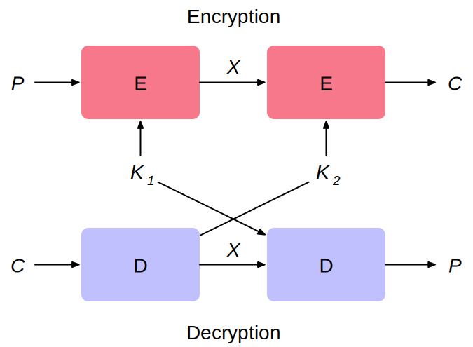
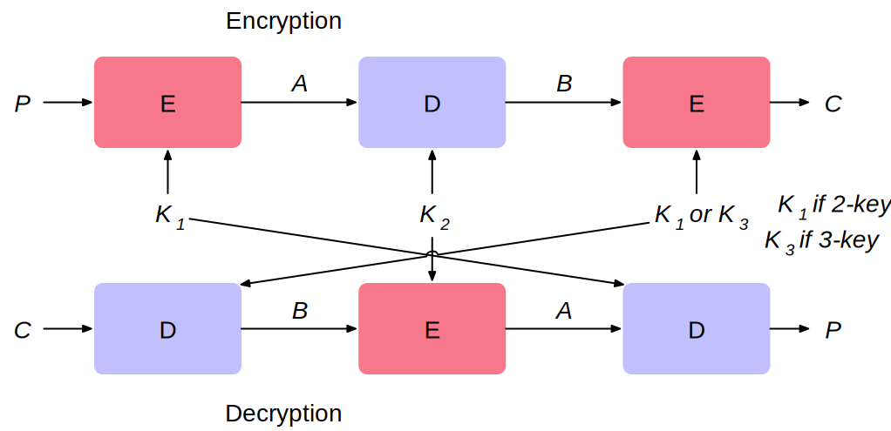
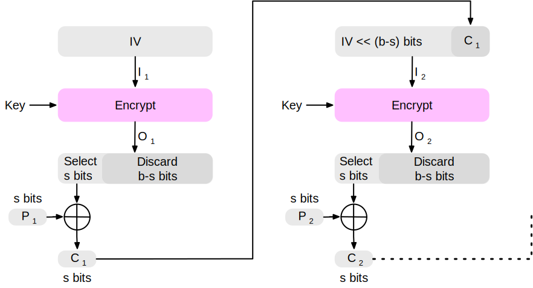
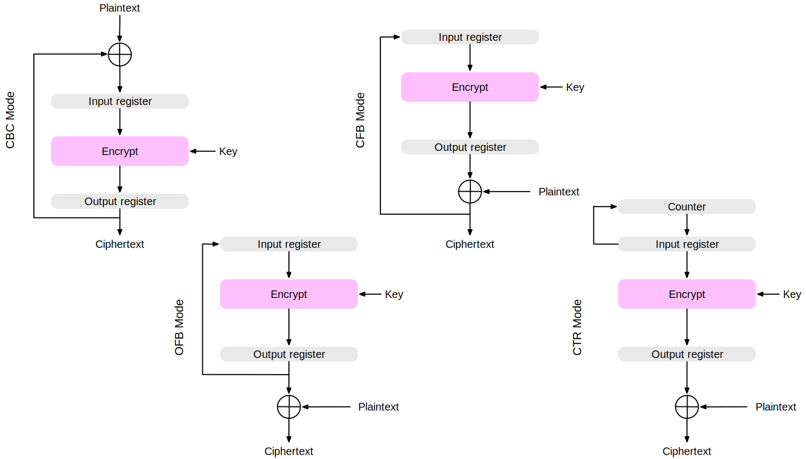
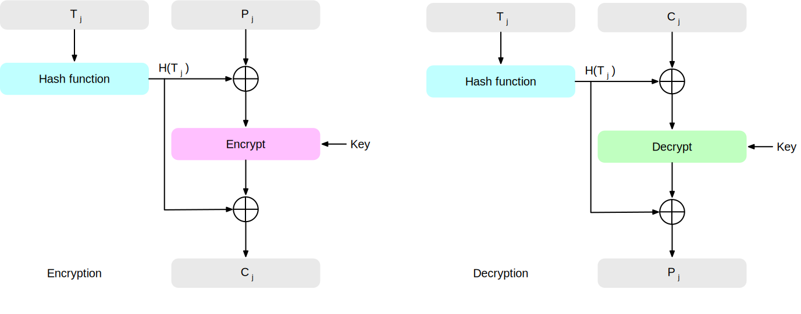
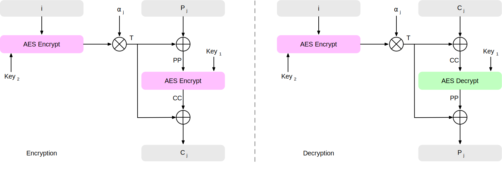

.. meta:: 
    :author: Michael Eichberg
    :keywords: Block Cipher Operation
    :description lang=en: Block Cipher Operations
    :description lang=de: Betriebsmodi bei Blockchiffren
    :id: 2023_10-W3M20014-block_cipher_operations
    :first-slide: last-viewed

.. |date| date::

.. role:: incremental
.. role:: ger
.. role:: red
.. role:: green 
.. role:: blue 
    
    

Block Cipher Operations
===============================================

:Lecturer: **Prof. Dr. Michael Eichberg**
:Version: |date|
:Based on: *Cryptography and Network Security - Principles and Practice, 8th Edition, William Stallings*

.. image:: logo.svg
    :alt: DHBW CAS Logo
    :scale: 4
    :class: logo

Double Encryption
-------------------------------

Meet-in-the-Middle Attack
--------------------------

- Observation: :math:`E(K_2,E(K_1,P)) = E(K_3,P)` does not hold. I.e., the use of double DES results in a mapping that is not equivalent to a single DES encryption. 

.. class:: incremental

- The meet-in-the-middle algorithm will attack this scheme. It does not depend on any particular property of DES but will work against any block encryption cipher.
- The result is that a known plaintext attack against double-DES will succeed with an effort on the order :math:`2^{56}` compared to :math:`2^{55}` for a single DES.
  

Triple Encryption (E.g., Triple-DES with Three-Keys)
-----------------------------------------------------

Triple-DES with Two Keys
-------------------------

Obvious counter to the meet-in-the-middle attack is to use three stages of encryption with three different keys.

- This raises the cost of the meet-in-the-middle attack to :math:`2^{112}`, which is beyond what is practical.
- Has the drawback of requiring a key length of :math:`56\,bits \times 3 = 168\,bits`, which may be somewhat unwieldy.
- As an alternative Tuchman proposed a triple encryption method that uses only two keys.
- 3DES with two keys is a relatively popular alternative to DES and has been adopted for use in the key management standards ANSI X9.17 and ISO 8732.

Triple-DES with Three Keys
--------------------------

- Several attacks against 3DES with 2 keys have been developed, which are - however - still not practical.
- Many researchers now feel that three-key 3DES is the preferred alternative.
- Three-key 3DES has an effective key length of 168 bits and is defined as: :math:`C=E(K_3,D(K_2,E(K_1, P)))` 
- Backward compatibility with DES is provided by putting: :math:`K_3 =K_2` or :math:`K_1 =K_2`.

Modes of Operation
--------------------

• A technique for enhancing the effect of a cryptographic algorithm or adapting the algorithm for an application.
• To apply a block cipher in a variety of applications, five modes of operation have been defined by NIST.

  • The five modes are intended to cover a wide variety of applications of encryption for which a block cipher could be used
  • These modes are intended for use with any symmetric block cipher, including 3DES and AES.

Modes of Operation - Overview
------------------------------

.. csv-table::
    :class: small
    :width: 100%
    :header: Mode, Description, Typical Application

    Electronic Codebook (ECB), Each block of plaintext bits is encoded independently using the same key., "
    • Secure transmission of single values (e.g., an encryption key) 
    "
    Cipher Block Chaining (CBC), The input to the encryption algorithm is the XOR of the next block of plaintext and the preceding block of ciphertext., " 
    • General-purpose block-oriented transmission 
    • Authentication
    "
    Cipher Feedback (CFB), "Input is processed s bits at a time.
    Preceding ciphertext is used as input to the encryption algorithm to produce pseudorandom output, which is XORed with plaintext to produce next unit of ciphertext.", " 
    • General-purpose stream-oriented transmission
    • Authentication
    " 
    Output Feedback (OFB), "Similar to CFB, except that the input to the encryption algorithm is the preceding encryption output, and full blocks are used.", " 
    • Stream-oriented transmission over noisy channel (e.g., satellite communication) 
    "
    "Counter (CTR)", "Each block of plaintext is XORed with an encrypted counter. The counter is incremented for each subsequent block.", " 
    • General-purpose block-oriented transmission
    • Useful for high-speed requirements
    "

Electronic Codebook
--------------------

.. image:: 6-ecb_encryption.svg
    :width: 1200px
    :align: center 

.. image:: 6-ecb_decryption.svg
    :width: 1200px
    :align: center 

.. container:: small
    
    Author: https://commons.wikimedia.org/wiki/User:WhiteTimberwolf

Problems when using ECB Mode Encryption
----------------------------------------

*ECB-Tux* - the linux pinguin encrypted using ECB mode.

.. image:: 6-tux.ecb.from_robert_david_graham.png

.. container:: small

    Source: https://github.com/robertdavidgraham/ecb-penguin

Criteria and properties for evaluating and constructing block cipher modes of operation that are superior to ECB.

- Overhead
- Error recovery 
- Error propagation
- Diffusion
- Security

Cipher Block Chaining
----------------------

.. image:: 6-cbc_encryption.svg
    :width: 1200px
    :align: center 

.. container:: incremental

    .. image:: 6-cbc_decryption.svg
        :width: 1200px
        :align: center 

    .. container:: small
        
        Author: https://commons.wikimedia.org/wiki/User:WhiteTimberwolf

Converting Block Ciphers into Stream Ciphers
--------------------------------------------

.. note::
    :class: smaller

    There are three modes that make it possible to convert a block cipher into a character-oriented stream cipher:

    - Cipher Feedback Mode (CFB)
    - Output Feedback Mode (OFB)
    - Counter Mode (CTR)

    I.e., no padding is required when the message is not a multiple of the block size.

For AES, DES, or any block cipher, encryption is performed on a block of b bits:

- In the case of (3)DES :math:`b=64` 
- In the case of AES :math:`b=128`

Cipher Feedback Mode
---------------------

.. container:: incremental

    .. image:: 6-cfb_decryption.svg
        :width: 1200px
        :align: center 

    .. container:: small
        
        Author: https://commons.wikimedia.org/wiki/User:WhiteTimberwolf

Cipher Feedback Mode used as a Stream Cipher
--------------------------------------------

Output Feedback Mode
---------------------

.. image:: 6-ofb_encryption.svg
    :width: 1200px
    :align: center 

.. container:: incremental
        
    .. image:: 6-ofb_decryption.svg
        :width: 1200px
        :align: center 

    .. container:: small
        
        Author: https://commons.wikimedia.org/wiki/User:WhiteTimberwolf

.. When used as a Stream Cipher we can simply discard the last bytes of the encrypted block cipher.

Counter Mode
-------------

.. image:: 6-ctr_encryption.svg
    :width: 1200px
    :align: center 

.. container:: incremental
        
    .. image:: 6-ctr_decryption.svg
        :width: 1200px
        :align: center 

    .. container:: small
        
        Author: https://commons.wikimedia.org/wiki/User:WhiteTimberwolf

Counter Mode - Advantages
-------------------------

:Hardware efficiency: can make use of hardware parallelization.
:Software efficiency: easily parallelizable in software.
:Preprocessing: the  encryption of the counters
:Random access: The i-th block of plaintext of ciphertext can be processed in random-access fashion.
:Provable security: as secure as the other modes 
:Simplicity: only the encryption algorithm is required.

Feedback Characteristics of Modes of Operation
-----------------------------------------------

XTS-AES Mode for Block-Oriented Storage Devices
-------------------------------------------------

Approved as an additional block cipher mode of operation by NIST in 2010 Mode is also an IEEE Standard, IEEE Std 1619-2007
 
.. note::

    Which potential threats are relevant?

    .. many similar blocks
    .. data is freely accessible

- Standard describes a method of encryption for data stored in sector- based devices where the threat model includes possible access to stored data by the adversary. 
  
- Has received widespread industry support

Tweakable Block Ciphers
------------------------

- XTS-AES mode is based on the concept of a tweakable block cipher 
- General structure:
  
  To compute the ciphertext a:

  - **Plaintext**
  - **Symmetric key**
  - **Tweak**
  
  is required.

- Tweak need not be kept secret; purpose is to provide variability.

Tweakable Block Ciphers
------------------------

Storage Encryption Requirements
--------------------------------

The requirements for encrypting stored data, also referred to as “data at rest”, differ somewhat from those for transmitted data.

The P1619 standard was designed to have the following characteristics:

.. class:: incremental

- The ciphertext is freely available for an attacker.
- The data layout is not changed on the storage medium and in transit.
- Data are accessed in fixed sized blocks, independently from each other.
- Encryption is performed in 16-byte blocks, independently from each other.
- There are no other metadata used, except the location of the data blocks within the whole data set.
- The same plaintext is encrypted to different ciphertexts at different locations, but always to the same ciphertext when written to the same location again.
- A standard conformant device can be constructed for decryption of data encrypted by another standard conformant device.

XTS-AES Operation on a Single Block
------------------------------------

.. container:: small two-columns

    - Key: The key where: :math:`Key = Key_1\, ||\, Key_2` 
    - :math:`P_j`: The jth block of plaintext. All blocks have length 128 bits. A plaintext data unit, typically a disk sector, consists of a sequence of plaintext blocks.
    - :math:`C_j`: The jth block of ciphertext.
    - :math:`j`: The sequential number of the 128bit block inside the data unit.
    - :math:`i`: The value of the 128bit tweak. 
    - :math:`\alpha`: A primitive element of GF(2^{128}) that corresponds to the polynomial :math:`x` (i.e., 0000...0010)
    - :math:`\alpha^j`: :math:`\alpha` multiplied by itself :math:`j` times in :math:`GF(2^{128})`  
    - :math:`\oplus` Bitwise XOR
    - :math:`\otimes` Modular multiplication with binary coefficients modulo :math:`x^{128}+x^7+x^2+x+1`.  

