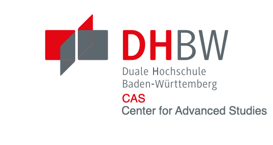

.. meta:: 
    :author: Michael Eichberg
    :keywords: exercise, public key cryptography

.. |date| date::

IT-Security Cryptography and Secure Communications
==================================================
    
:Excercise: **Public Key Cryptography**
:Lecturer: *Prof. Dr. Michael Eichberg*
:Version: |date|

1. Execute the Square-and-Multiply algorithm for 3^17 mod 23.

  .. solution      i = 4; f= 3 =>      i = 3; f=9 =>     i = 2; f= 81 mod 23 = 12 =>     i = 1; f= 144 mod 23 = 6 =>      i = 0; f= (((6*6)mod 23) * 3) mod 23 = 16

2. Perform an encryption of a message using RSA. 
   
   I.e., choose 2 small prime numbers, compute e,d,n. Then encrypt the message (i.e., a (rather) small value) using the public key of a fellow student and send him the encrypted message. Let her/him decrypt your message. Afterwards validate that the encryption is successful.

   .. solution (e.g.): p = 7, q = 11 => n = p * q = 11; phi(n) = (p-1)(q-1)=6*10 = 60; hence the message has to be "less than" 60. Compute e such that gcd(phi(n),e) = 1. In this case, 3 and 5 are not possible candiates, because 3|60 and 5|60. 7 will do the job. Compute d; i.e., e*d mod(phi(n)) = 1. Now: PU = {7,77}, PR = {3,77}; let the message M be "13". c = 13^7 mod 77 = **62**. To get the plaintext compute 62^3 mod 77.

3. Can you think of a scenario in which fault-based attacks may be practical?

   .. solution: in it forensics. E.g., to send a device a custom firmware to enable a forensically sound dump of the device.

