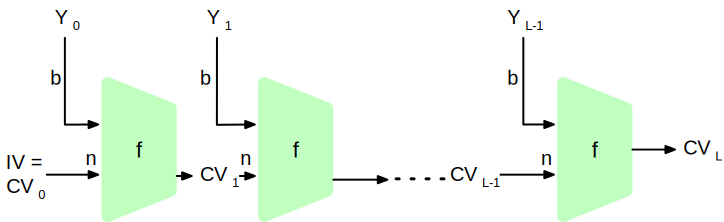

.. meta:: 
    :author: Michael Eichberg
    :keywords: hash functions
    :description lang=en: Cryptographic Hash Functions
    :description lang=de: Kryptografische Hashfunktionen
    :id: 2023_10-W3M20014-hash_functions
    :first-slide: last-viewed

.. |date| date::

.. role:: incremental
.. role:: ger
.. role:: red
.. role:: green 
.. role:: blue 
    
    

Cryptographic Hash Functions
===============================================

:Lecturer: **Prof. Dr. Michael Eichberg**
:Version: |date|
:Based on: *Cryptography and Network Security - Principles and Practice, 8th Edition, William Stallings*

.. image:: logo.svg
    :alt: DHBW CAS Logo
    :scale: 4
    :class: logo

Hash Function
-------------------------------

.. class:: incremental

- A hash function H accepts a variable-length block of data :math:`M` as input and produces a fixed-size result :math:`h = H(M)`.
- A good hash function will produce outputs that are evenly distributed and apparently random.
- Often used to ensure data integrity. A change to any bit in M should result with a high probability in a change of the hash value.
- Cryptographic hash functions are nedded for security applications.
- Applications:

  - Message Authentication
  - Digitial Signatures
  - One-way Password Files

Security Requirements for a Cryptographic Hash Function H
----------------------------------------------------------

:Variable Input Size: H can be applied to a block of data of any size.
:Fixed Output Size: H produces a fixed-length output
:Efficiency:

  When used for message authentication and digital signatures :math:`H(x)` is relatively easy to compute for any given :math:`x`, making both hardware and software implementations practical.

  vs. 

  When used for password hashing it is hard to efficiently compute the hash even on specialized hardware (GPUs, ASICs) to thwart attackers.

Security Requirements for a Cryptographic Hash Function H
----------------------------------------------------------

:Preimage resistant (one-way property): For any given hash value :math:`h`, it is computationally infeasible to find :math:`y` such that :math:`H(y) = h`
:Second preimage resistant (weak collision resistant): For any given block x, it is computationally infeasible to find :math:`y \neq x` with :math:`H(x) = H(y)`
:Collision resistant (strong collision resistant): It is computationally infeasible to find any pair :math:`(x,y)` with :math:`x \neq y`, such that :math:`H(x) = H(y)`
:Pseudorandomness: Output of H meets standard tests for pseudorandomness.

Hash Function Resistance Properties Required 
----------------------------------------------

.. csv-table::
    :header: "", Preimage Resistant, Second Preimage Resistant, Collision Resistant
    :class: smaller
    
    Hash + digital signature, yes, yes, yes
    Intrusion detection and virus detection, , yes , 
    Hash + symmetric encryption, , , ,
    One-way password file, yes, , 
    MAC, yes, yes, yes

Relationship Among Hash Function Properties
--------------------------------------------

.. admonition:: Note
    :class: small incremental

    A collision attack requires less effort than a preimage or second preimage attack.

    This is explained by the birthday paradox. If we choose random variables from a uniform distribution in the range 0 through N-1, then the probability that a repeated element is encountered exceeds 0.5 after :math:`\sqrt{N}` choices. Hence, for an m-bit hash value, if we pick data blocks at random, we can expect to find two data blocks within :math:`\sqrt{2^m} = 2^{m/2}` attempts.  

    .. container:: incremental small separated

        Constructing similar messages is relatively easy. If your text has 8 places where you could 
        exchange a word with another one you already have :math:`2^{8}` different texts.

        Constructing comparable(1) messages is very(2) simple(3). If your text has 8 places where you could replace(4) a character sequence(5) with another word(6) you will(7) have :math:`2^{8}` different messages(8).

Structure of Secure Hash Code
------------------------------

.. container:: two-columns smaller

    :math:`IV` = Initial Value (algorithm dependent)

    :math:`CV_i` = Chaining variable
    
    :math:`Y_i` = ith input block
    
    :math:`f` = compression function
    
    :math:`n` = Length of block

    :math:`L` = Number of input blocks 
    
    :math:`b` = Length of input block

Password Recovery
-------------------

Passwords are often stored using hashes.

Example using the md5 hash function:

.. class:: hexdump

:: 

    md5 ("Hello") = 8b1a9953c4611296a827abf8c47804d7
    md5 ("hello") = 5d41402abc4b2a76b9719d911017c592
    md5 ("Dieses Passwort ist wirklich total sicher 
          und falls Du es mir nicht glaubst, dann
          tippe es zweimal hintereinander blind 
          fehlerfrei ein.") 
                  = 8fcf22b1f8327e3a005f0cba48dd44c8

Usage of Cryptographic Hash Functions
------------------------------------------

- Known cryptographic hash functions: MD4, MD5, SHA-256, SHA-512, RIPE-MD, PBKDF2, …
- When used for password hashing the algorithms are usually applied many times to increase the runtime to make it harder for adversaries.
- Several hash algorithms were explicitly designed for passwort hashing to withstand common attacks. E.g., bcrypt, scrypt, Argon2
- Some of these algorithms are so computationally involved that they are not suitable for web applications/situations where have to authorize many users at a time. These algorithms are typically used to protect local harddisks or containers.

Passwords are not always explicitly stored 
-----------------------------------------------------------

Encryption of Containers (e.g., Veracrypt)
___________________________________________

Passwords are not always explicitly stored 
-----------------------------------------------------------

Generic File Encryption
_______________________

Password Recovery
------------------

1. know where to “find” the hash to recovery

.. class:: incremental

2. extract the hash
3. recover the hash

.. class:: incremental smaller

    **Example - recovery of a linux login password**

    .. code:: bash
    
        ~% sudo cat /etc/shadow      
        [...]
        john:$6$zElzjLsMqi36JXWG$FX2Br1/[...]. ↩︎
        RxAHnNCBsqiouWUz751crHodXxs0iqZfBt9j40l3G0:19425:0:99999:7:::
        [...]
    
    .. code:: bash
        
        % echo -n '$6$zElzjLsMqi36JXWG$FX2Br1/[...]. ↩︎
        RxAHnNCBsqiouWUz751crHodXxs0iqZfBt9j40l3G0' > hash.txt 
    
    .. code:: bash
        
        % hashcat -m 1800 hash.txt -a 3 ‘?d?d?d?d?d?d'

Sources of Passwords
--------------------

Passwords are often created using one or more of the following sources:

- Pins (e.g., 1111, 1234, 123456, …)
- Keyboard Walks (e.g., asdfg, q2w3e4r5t)
- Patterns (e.g., aaaaa, ababab, abcabcabc)
- Dictionaries (e.g., Duden, Webster, …)
- Context Information
- Password Generators

A good source for studying the construction of passwords are so-called *leaks* and *lists with common password*.

Common Password Lists
----------------------

.. container:: three-columns

    123456
    password
    123456789
    12345
    12345678
    qwerty
    1234567
    111111
    1234567890
    123123
    abc123
    1234
    password1
    iloveyou
    1q2w3e4r
    000000
    qwerty123
    zaq12wsx
    dragon
    sunshine
    princess
    letmein
    654321
    monkey
    27653
    1qaz2wsx
    123321
    qwertyuiop
    superman
    asdfghjkl

Source: `Becker's Health IT <https://www.beckershospitalreview.com/cybersecurity/30-most-common-passwords-of-2023.html>`__

- The lists typically don't change much year-over-year.
- The methodology is often questionable.

Challenges When Recovering Passwords (Hashrates)
------------------------------------------------

.. csv-table::
    :class: incremental small

    Hashcat Mode (Hashcat 6.2.6), Hash, "RTX 1080Ti
    250 W", "RTX 2080TI 
    260 W", "RTX 3090 
    350 W", "RTX 4090 
    450 W"
    25700, Murmur, , , , "643700.0 (643 GH/s)"
    23, Skype, 21330.1 , 27843.1 , 37300.7 , 84654.8 
    1400, SHA2-256, 4459.7 , 7154.8 , 9713.2 , 21975.5 
    10500, PDF1.4-1.6, 24.9 , 29.8 , 76.8 ,  122.0 
    1800, SHA 512 Unix (5000 Iterations), 0.2 , 0.3  , 0.5 , 1.2 
    13723, Veracrypt SHA2- 512 + XTX 1536Bit, 0.0004 , 0.0006  , 0.0009 , "0.002
    (2000 H/s)"

.. container:: small incremental

    **Sources:**

    :4090: https://gist.github.com/Chick3nman/e4fcee00cb6d82874dace72106d73fef
    :3090: https://gist.github.com/Chick3nman/e4fcee00cb6d82874dace72106d73fef
    :1080Ti: https://www.onlinehashcrack.com/tools-benchmark-hashcat-nvidia-gtx-1080-ti.php
    :2080Ti: https://gist.github.com/binary1985/c8153c8ec44595fdabbf03157562763e

Challenges When Recovering Passwords - (Hashrates)
--------------------------------------------------

Challenges When Recovering Passwords - (Hashrates)
--------------------------------------------------

    **Attacking LUKS2 with Argon2**

    […] The choice of Argon2 as a KDF makes GPU acceleration impossible. As a result, you’ll be restricted to CPU-only attacks, which may be very slow or extremely slow depending on your CPU. To give an idea, you can try 2 (that’s right, two) passwords per second on a single Intel(R) Core(TM) i7-9700K CPU @ 3.60GHz. Modern CPUs will deliver a slightly better performance, but don’t expect a miracle: LUKS2 default KDF is deliberately made to resist attacks. […]

    https://blog.elcomsoft.com/2022/08/probing-linux-disk-encryption-luks2-argon-2-and-gpu-acceleration

Challenges When Recovering Passwords - (Password Policies)
----------------------------------------------------------

Modern password policies make it impossible to directly use older leaks.

.. note::  
    :class: small

    If you want to have some fun with passwords:

    https://neal.fun/password-game/
    

*Examples:*

.. class:: incremental

- minimum number of characters (maximum number of characters)
- requirements on the number of digits, special chars, upper and lower case letters
- requirements on the diversity of the used characters
- some passwords (e.g., from known leaks and dictionaries) are forbidden
- ... 

Understanding the Nature of Passwords
--------------------------------------

Here, we mapped every lowercase letter to l, upper case letters to u, digits to d and special chars to s.

.. class:: small

Analysis based on the “famous” rockyou leak.

.. csv-table::
    :align: left
    :width: 1800px
    :class: small

    llllllll, 4,8037 %, lllllllldd, 1,4869 %, dddddddddddd, 0,2683 %, ddddddll, 0,1631 %
    llllll, 4,1978 %, lllllld, 1,3474 %, lllddddd, 0,2625 %, lllllls, 0,1615 %
    lllllll, 4,0849 %, llllllld, 1,3246 %, lllllllllldd, 0,2511 %, ddddlll, 0,1613 %
    lllllllll, 3,6086 %, llllllllllll, 1,3223 %, llllllllllllllll, 0,2340 %, dlllllll, 0,1583 %
    ddddddd, 3,4003 %, llldddd, 1,2439 %, lllldddddd, 0,2322 %, dllllll, 0,1575 %
    dddddddddd, 3,3359 %, llllldddd, 1,2109 %, llddddd, 0,2270 %, llllddddd, 0,1560 %
    dddddddd, 2,9878 %, lllllldddd, 1,1204 %, uuuuuudd, 0,2189 %, dddddddl, 0,1557 %
    lllllldd, 2,9326 %, lllllllld, 1,1168 %, ddddll, 0,2169 %, uuuudd, 0,1551 %
    llllllllll, 2,9110 %, lllllddd, 1,0633 %, lddddddd, 0,2064 %, lllllddddd, 0,1395 %
    dddddd, 2,7243 %, llllllddd, 0,9225 %, ddddddddddddd, 0,2017 %, ddllllll, 0,1391 %
    ddddddddd, 2,1453 %, llllllllld, 0,9059 %, ullllldd, 0,1930 %, ulllll, 0,1379 %
    llllldd, 2,0395 %, lllll, 0,8793 %, ddddllll, 0,1905 %, uuuuuuuuuu, 0,1378 %
    llllllldd, 1,9092 %, lllllllllllll, 0,8334 %, uuuuuuuuu, 0,1886 %, llllllls, 0,1374 %
    lllllllllll, 1,8697 %, llllld, 0,8005 %, uuuuudd, 0,1815 %, lllllllllld, 0,1345 %
    lllldddd, 1,6420 %, llllddd, 0,7759 %, lllllllllddd, 0,1808 %, llllllllllldd, 0,1344 %
    lllldd, 1,5009 %, ddddddddddd, 0,7524 %, llllllllldddd, 0,1725 %, …, …

Understanding the Nature of Passwords
--------------------------------------

.. class:: small

Analysis based on the “famous” rockyou leak.

.. note:: 
    :class: incremental small

    The languages that were considered when identifying words were: "de, en, fr, es, pt, nl".
    
    *Popular words* are words used on Twitter or Facebook, e.g., "iloveu", "iluvu", ....

.. csv-table::
    :class: small 
    :header: all passwords, 14.334.851, "100%"

    pins, 2.346.591, "16,37 %"
    passwords with letters, 11.905.977, "83,34 %"

.. csv-table::
    :class: small no-borders
    :header: "Category", "Absolute", "Percentage", "Examples"
    
    
    emails, 26.749, "0,22 %", me@me.com, , , 
    numbers framed by letters, 35696, "0,30 %", a123456a, , , 
    leetspeak, 64.672, "0,54 %", G3tm0n3y, , , 
    patterns, 124.347, "1,04 %", lalala, , , 
    regular or popular words, 4.911.647, "**41,25 %**", princess, iloveu, , 
    sequences, 5.290, "0,04 %", abcdefghij, , , 
    keyboard walks (de/en), 14.662, "0,12 %", q2w3e4r, , , 
    simple word combinations, 535.037, "4,49 %", pinkpink, sexy4u, te amo, 
    complex word combinations, 5.983.259, "**50,25 %**", Inparadise, kelseylovesbarry, , 
    <rest>, 204.618, "1,72 %", j4**9c+p, i(L)you, p@55w0rd, sk8er4life

Understanding the Nature of Passwords
--------------------------------------

The effect of password policies
_______________________________

Real-world Policy: 

    Use 1 upper, 1 lower, 2 symbols, 2 digits, 4 letters, 4 non-letters

.. container:: incremental

    Effect:

        Password11##
        Password12!! 

Understanding the Nature of Passwords
--------------------------------------

- Passwords that need to be entered frequently are in the vast majority of cases based on “real” words.
- Real words are often not used as is, but are transformed using simple rules; e.g., by appending a number or by appending a special character, …

.. admonition:: Question 
    :class: incremental small
    
    How can we identify/generate good password candidates if a leak is not sufficient or if only a small number of passwords can be tested? 
    
    E.g., testing all passwords of rockyou takes…:
    
    ~13.000.000 Passwords / 5 H/s = ~1 month

    ~13.000.000 Passwords / 5 H/h = ~297 years

Password Cracking Using Probabilistic Context-Free Grammars 
------------------------------------------------------------

.. class:: incremental 
    

- Generate password patterns in order of decreasing probability.
  
  - Directly useable as guesses 
  - Used as word-mangling templates that are to be filled using dictionaries(E.g., pre-terminal structure: ``S → D1L3S2 → 1L3!! → 1luv!!`` ) 
  
- Learn the patterns, words, special chars and digits based on real-world leaks
  
- Process: 
  
  1. Pre-processing to identify base structures and probabilities(e.g. 2 numbers followed by special char by 8 letters)
  2. Password guess generation taking the probabilities of the rules and the digits/special chars into account; the probability of the alpha strings is not considered. 

SePass: Semantic Password Guessing Using k-nn Similarity Search in Word Embeddings
-----------------------------------------------------------------------------------

Extension of PCFG where additional candidate words are identified using *Word Embeddings*. Enables to automatically find related words.

**Example**

.. container:: two-columns smaller

    .. container::

        Given:

            *Ferrari*\ 01
        
            !*Audi*!
        
            *Mercedes*\ 88
        
            *Bugatti*\ 666

    .. container:: 

        ("Obvious") Base Word Candidates:

            .. container:: incremental

                Porsche
        
                Mclaren

                Lamborghini

                Aston Martin

SePass: Semantic Password Guessing Using k-nn Similarity Search in Word Embeddings
-----------------------------------------------------------------------------------

Avoids human bias.

**Example**

.. container:: two-columns smaller

    .. container::

        Given:

            Luke2017

            John1976

            01Mark!

    .. container:: 

        ("Obvious") Base Word Candidates:

            .. container:: incremental

                Matthew
        
                Bible

                Gospel

SePass: Semantic Password Guessing Using k-nn Similarity Search in Word Embeddings
-----------------------------------------------------------------------------------

Avoids human bias.

**Example**

.. container:: two-columns smaller

    .. container::

        Given:

            Luke2017

            John1976

            01Mark!

    .. container:: 

        ("Obvious") Base Word Candidates:

            .. container:: incremental

                Leia
        
                Darth Vader

                Palpatine                

SePass: Conceptual
------------------

